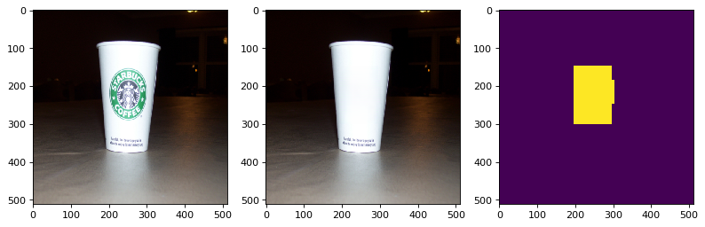
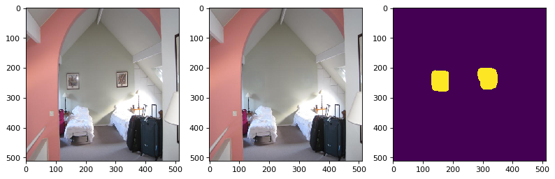
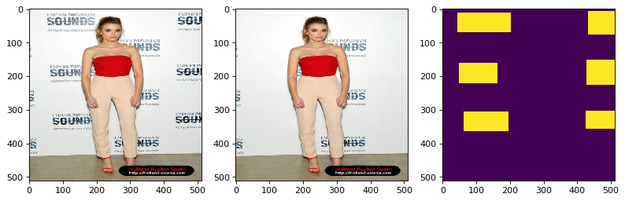
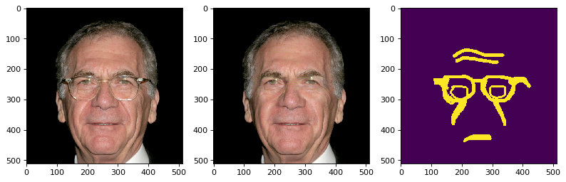

# 复现说明

**队名**：FutureSI

**复现论文**：（[兴7](https://aistudio.baidu.com/aistudio/competition/detail/439/0/introduction/)）Aggregated Contextual Transformations for High-Resolution Image Inpainting


**复现精度**：psnr mean: 26.040011890714432 ssim mean: 0.8901153302745654

**训练、验证时保存的日志说明**：

1）论文模型采用batch size=8，训练了100万个iter。

我在AI Studio上复现时，开始用单卡A100的GPU，跑前6万个iter用的batch size=8（log整理在了log1_a100_bs8.txt文件中）

后来在四卡V100的GPU上，跑的25万个iter用的batch size=24（log整理在了log2_v100_bs6x4.txt文件中）

这样复现模型的样本折算为batch size=8情况下训练次数为 6万 + 25万 * 3 = 81万，比原论文迭代的100万次少。（复现跑的log存放在项目路径的 output/log.txt文件中）

2）验证模型精度时保存的psnr和ssim指标存放在项目路径的 output/psnr_ssim.txt 文件中。

左数第一列为验证图片序号，使用place2stand数据集的验证集，共36500张图片。mask使用NVIDIA Irregular Mask Dataset数据集的测试集中擦除率为20%至30%的掩码图片。（验收要求）

左数第二列为预测图片的psnr值

左数第三列为预测图片的ssim值


# 模型验证（快速验证论文复现指标）

1）**安装计算psnr ssim的依赖库**


```python
#安装计算psnr ssim的依赖库
!pip install scikit-image


```

2）**处理验证数据集**

* 图片数据解压至项目路径下的 dataset/val_img 文件夹下
* mask挤压至项目路径下的 dataset/val_mask 文件夹下
* 验证数据集已搬运到AI Studio上（[下载地址](https://aistudio.baidu.com/aistudio/datasetdetail/89198)），使用时请遵守发布者的版权规范。图片数据为Place365Stand的验证集，mask掩码为NVIDIA Irregular Mask Dataset的测试集（同原论文）


```python
%cd /home/aistudio/
# 解压数据集
import os
if not os.path.exists('AOT_GAN_Paddle/dataset/'):
    os.mkdir('AOT_GAN_Paddle/dataset/')
!unzip -qa -d data/ data/data89198/test_mask.zip
%mv data/mask/testing_mask_dataset/ AOT_GAN_Paddle/dataset/val_mask
%rm -r data/mask/
!tar -xf /home/aistudio/data/data89198/val_large.tar -C data
%mv data/val_large/ AOT_GAN_Paddle/dataset/val_img

# 验证使用的mask与训练使用的mask是同一数据集（同原论文模型），验收要求遮蔽率20%-30%，这里删除多余的mask文件，
# 只剩下2000张遮蔽率为20%-30%的mask图片文件。
import cv2
import numpy as np
import os
path = 'AOT_GAN_Paddle/dataset/val_mask'
for _, _, files in os.walk(path):
    files = np.sort(np.array(files))
    break
for i, f in enumerate(files):
    m = cv2.imread(os.path.join(path, f), cv2.IMREAD_GRAYSCALE)
    rate = m.sum() / 255 / 512 / 512 
    print(i, rate)
    if rate < .2 or rate > .3:
        print('remove')
        os.remove(os.path.join(path, f))
```

3）**运行验证脚本**

* 验证模型精度时保存的psnr和ssim指标存放在项目路径下的 output/psnr_ssim.txt 文件中。
* 验证过程中生成的图片存储在项目路径下的 output/pic_val 文件夹中。
* 推理过程中环境、超参的设定在项目路径下的 model/config.py 文件中。

（下面的代码cell保存了上次运行验证过程的完整log打印输出，最后一行的“psnr mean: 26.040011890714432 ssim mean: 0.8901153302745654”即为模型最终的psnr和ssim指标。）


```python
%cd /home/aistudio/AOT_GAN_Paddle

!python val.py # 执行参数请参考val.py脚本中的注释
```

    /home/aistudio/AOT_GAN_Paddle
    已经完成 [314952] 步训练，开始验证...
    W0920 10:03:54.479632 11366 gpu_resources.cc:61] Please NOTE: device: 0, GPU Compute Capability: 7.0, Driver API Version: 11.2, Runtime API Version: 11.2
    W0920 10:03:54.483983 11366 gpu_resources.cc:91] device: 0, cuDNN Version: 8.2.
    val.py:58: FutureWarning: `multichannel` is a deprecated argument name for `structural_similarity`. It will be removed in version 1.0. Please use `channel_axis` instead.
      ssim = compare_ssim(img_show1, img_show2, multichannel=True)  # 对于多通道图像(RGB、HSV等)关键词multichannel要设置为True
    current_step: 0 filename: dataset/val_img/Places365_val_00000001.jpg psnr: 19.973892724416423 ssim: 0.8249856740962208 psnr mean: 19.973892724416423 ssim mean: 0.8249856740962208 2022-09-20 10:03:57
    current_step: 100 filename: dataset/val_img/Places365_val_00000101.jpg psnr: 22.30029094468997 ssim: 0.8564899927420897 psnr mean: 25.270560812420875 ssim mean: 0.8898851025092125 2022-09-20 10:04:14
    current_step: 200 filename: dataset/val_img/Places365_val_00000201.jpg psnr: 23.8328355748601 ssim: 0.8822300521056575 psnr mean: 25.47297330265283 ssim mean: 0.8885630976611673 2022-09-20 10:04:31
    current_step: 300 filename: dataset/val_img/Places365_val_00000301.jpg psnr: 28.696053157347396 ssim: 0.8906825477517337 psnr mean: 25.733249408537056 ssim mean: 0.8879750096527442 2022-09-20 10:04:51
    current_step: 400 filename: dataset/val_img/Places365_val_00000401.jpg psnr: 24.590365818939226 ssim: 0.8700233296831031 psnr mean: 25.83516455033135 ssim mean: 0.8890239067146705 2022-09-20 10:05:09
    current_step: 500 filename: dataset/val_img/Places365_val_00000501.jpg psnr: 28.533166103728938 ssim: 0.9553104969079182 psnr mean: 25.675826944675027 ssim mean: 0.8876833185388846 2022-09-20 10:05:27
    current_step: 600 filename: dataset/val_img/Places365_val_00000601.jpg psnr: 28.93545478619792 ssim: 0.8865497405628421 psnr mean: 25.66602955865216 ssim mean: 0.8869899266181366 2022-09-20 10:05:44
    current_step: 700 filename: dataset/val_img/Places365_val_00000701.jpg psnr: 27.890954926596166 ssim: 0.8921445666381919 psnr mean: 25.685000215008056 ssim mean: 0.8875061470681183 2022-09-20 10:06:00
    current_step: 800 filename: dataset/val_img/Places365_val_00000801.jpg psnr: 26.115762934531013 ssim: 0.8899534904180645 psnr mean: 25.76048740736537 ssim mean: 0.888350121343028 2022-09-20 10:06:17
    current_step: 900 filename: dataset/val_img/Places365_val_00000901.jpg psnr: 27.447128898754734 ssim: 0.9394618608559714 psnr mean: 25.78790101811149 ssim mean: 0.8884092450892976 2022-09-20 10:06:34
    current_step: 1000 filename: dataset/val_img/Places365_val_00001001.jpg psnr: 30.35180072086643 ssim: 0.9309530130726659 psnr mean: 25.794700891573985 ssim mean: 0.88864158029827 2022-09-20 10:06:51
    current_step: 1100 filename: dataset/val_img/Places365_val_00001101.jpg psnr: 23.38714937693609 ssim: 0.8184470120693786 psnr mean: 25.809534984970202 ssim mean: 0.888282307864016 2022-09-20 10:07:07
    current_step: 1200 filename: dataset/val_img/Places365_val_00001201.jpg psnr: 22.555733685358675 ssim: 0.857590986524483 psnr mean: 25.801494052239434 ssim mean: 0.8879885520753285 2022-09-20 10:07:24
    current_step: 1300 filename: dataset/val_img/Places365_val_00001301.jpg psnr: 27.89102270348529 ssim: 0.9220202394886764 psnr mean: 25.840329004216542 ssim mean: 0.8887027270210016 2022-09-20 10:07:41
    current_step: 1400 filename: dataset/val_img/Places365_val_00001401.jpg psnr: 26.45887037259575 ssim: 0.9010310942190204 psnr mean: 25.825812337696846 ssim mean: 0.888517865559783 2022-09-20 10:07:58
    current_step: 1500 filename: dataset/val_img/Places365_val_00001501.jpg psnr: 33.12816423218146 ssim: 0.9427865599287135 psnr mean: 25.863773961806626 ssim mean: 0.88886049256036 2022-09-20 10:08:16
    current_step: 1600 filename: dataset/val_img/Places365_val_00001601.jpg psnr: 32.37730066161831 ssim: 0.9048905144334732 psnr mean: 25.878384397648702 ssim mean: 0.8891968745897441 2022-09-20 10:08:33
    current_step: 1700 filename: dataset/val_img/Places365_val_00001701.jpg psnr: 30.763703636560557 ssim: 0.9353213240760029 psnr mean: 25.875593162966023 ssim mean: 0.8891177263662973 2022-09-20 10:08:50
    current_step: 1800 filename: dataset/val_img/Places365_val_00001801.jpg psnr: 35.21681469474517 ssim: 0.9466867653641692 psnr mean: 25.902154284526766 ssim mean: 0.8892586682641993 2022-09-20 10:09:06
    current_step: 1900 filename: dataset/val_img/Places365_val_00001901.jpg psnr: 29.93194359077034 ssim: 0.918308732838718 psnr mean: 25.935731622942022 ssim mean: 0.8895194675551716 2022-09-20 10:09:24
    current_step: 2000 filename: dataset/val_img/Places365_val_00002001.jpg psnr: 36.24201791920029 ssim: 0.9382700267448412 psnr mean: 25.946269296698546 ssim mean: 0.8897454661135128 2022-09-20 10:09:41
    current_step: 2100 filename: dataset/val_img/Places365_val_00002101.jpg psnr: 31.153572114296992 ssim: 0.9010163251992411 psnr mean: 25.94397388359005 ssim mean: 0.8898208436142289 2022-09-20 10:09:58
    current_step: 2200 filename: dataset/val_img/Places365_val_00002201.jpg psnr: 22.506907678927558 ssim: 0.8551865735270249 psnr mean: 25.96250549557571 ssim mean: 0.8897643044373287 2022-09-20 10:10:14
    current_step: 2300 filename: dataset/val_img/Places365_val_00002301.jpg psnr: 30.317647505372246 ssim: 0.8898120045675633 psnr mean: 26.004002256725244 ssim mean: 0.890250340647986 2022-09-20 10:10:31
    current_step: 2400 filename: dataset/val_img/Places365_val_00002401.jpg psnr: 24.729024867517623 ssim: 0.906600640523647 psnr mean: 26.018507738740333 ssim mean: 0.8903476571159346 2022-09-20 10:10:48
    current_step: 2500 filename: dataset/val_img/Places365_val_00002501.jpg psnr: 27.20448272676052 ssim: 0.9057464001783476 psnr mean: 26.00609099371339 ssim mean: 0.8902092508078162 2022-09-20 10:11:06
    current_step: 2600 filename: dataset/val_img/Places365_val_00002601.jpg psnr: 24.611235957718502 ssim: 0.8635562197756448 psnr mean: 25.981006859031986 ssim mean: 0.8899970523744771 2022-09-20 10:11:24
    current_step: 2700 filename: dataset/val_img/Places365_val_00002701.jpg psnr: 26.11350995211734 ssim: 0.8574994327815101 psnr mean: 25.98535874118673 ssim mean: 0.8900375741072495 2022-09-20 10:11:42
    current_step: 2800 filename: dataset/val_img/Places365_val_00002801.jpg psnr: 31.60054775569929 ssim: 0.9432292307031963 psnr mean: 25.988517692151394 ssim mean: 0.89008836134358 2022-09-20 10:12:01
    current_step: 2900 filename: dataset/val_img/Places365_val_00002901.jpg psnr: 22.862513834862117 ssim: 0.843261944814989 psnr mean: 25.993708458682487 ssim mean: 0.8900416188087544 2022-09-20 10:12:19
    current_step: 3000 filename: dataset/val_img/Places365_val_00003001.jpg psnr: 25.33784052586845 ssim: 0.8860066171936353 psnr mean: 25.984370581466983 ssim mean: 0.8900080151059858 2022-09-20 10:12:37
    current_step: 3100 filename: dataset/val_img/Places365_val_00003101.jpg psnr: 22.513645238230445 ssim: 0.8861513177608771 psnr mean: 26.003407212843186 ssim mean: 0.8901385206162596 2022-09-20 10:12:55
    current_step: 3200 filename: dataset/val_img/Places365_val_00003201.jpg psnr: 19.818931055686274 ssim: 0.8206852026165968 psnr mean: 25.9984577235117 ssim mean: 0.8902325996185285 2022-09-20 10:13:13
    current_step: 3300 filename: dataset/val_img/Places365_val_00003301.jpg psnr: 25.31671567431229 ssim: 0.8578803546237688 psnr mean: 26.006445819213663 ssim mean: 0.8903462608632693 2022-09-20 10:13:30
    current_step: 3400 filename: dataset/val_img/Places365_val_00003401.jpg psnr: 22.19825694838295 ssim: 0.8819848958331958 psnr mean: 26.001287118148166 ssim mean: 0.8903464833299936 2022-09-20 10:13:47
    current_step: 3500 filename: dataset/val_img/Places365_val_00003501.jpg psnr: 36.67656046680983 ssim: 0.958283816543312 psnr mean: 25.999784075319447 ssim mean: 0.8902824935963449 2022-09-20 10:14:04
    current_step: 3600 filename: dataset/val_img/Places365_val_00003601.jpg psnr: 25.037643820250544 ssim: 0.8712938108379212 psnr mean: 25.99578315314856 ssim mean: 0.8902863929182315 2022-09-20 10:14:21
    current_step: 3700 filename: dataset/val_img/Places365_val_00003701.jpg psnr: 31.017929716914367 ssim: 0.9607826103208464 psnr mean: 25.985258412688296 ssim mean: 0.8902489337221845 2022-09-20 10:14:38
    current_step: 3800 filename: dataset/val_img/Places365_val_00003801.jpg psnr: 27.396050754647035 ssim: 0.8944556066315799 psnr mean: 25.99701109712571 ssim mean: 0.8904731962998931 2022-09-20 10:14:55
    current_step: 3900 filename: dataset/val_img/Places365_val_00003901.jpg psnr: 22.046942785862313 ssim: 0.8064729033688279 psnr mean: 25.997888584870747 ssim mean: 0.890504259165806 2022-09-20 10:15:12
    current_step: 4000 filename: dataset/val_img/Places365_val_00004001.jpg psnr: 26.004407087824447 ssim: 0.8855064083731322 psnr mean: 25.99082071261343 ssim mean: 0.8904363681577695 2022-09-20 10:15:30
    current_step: 4100 filename: dataset/val_img/Places365_val_00004101.jpg psnr: 24.815712049823404 ssim: 0.8705216997351132 psnr mean: 25.98082614410205 ssim mean: 0.8904663472465685 2022-09-20 10:15:46
    current_step: 4200 filename: dataset/val_img/Places365_val_00004201.jpg psnr: 26.357316023592592 ssim: 0.8985505208969365 psnr mean: 25.979489843699074 ssim mean: 0.8904242324263871 2022-09-20 10:16:03
    current_step: 4300 filename: dataset/val_img/Places365_val_00004301.jpg psnr: 26.207525843684248 ssim: 0.924521402745941 psnr mean: 25.984174354869424 ssim mean: 0.8904165040057948 2022-09-20 10:16:20
    current_step: 4400 filename: dataset/val_img/Places365_val_00004401.jpg psnr: 25.648513263793422 ssim: 0.9336762755656555 psnr mean: 25.980579796733466 ssim mean: 0.8903901479728107 2022-09-20 10:16:37
    current_step: 4500 filename: dataset/val_img/Places365_val_00004501.jpg psnr: 32.0902582816161 ssim: 0.9408663307624372 psnr mean: 25.989849958559784 ssim mean: 0.8904524234254713 2022-09-20 10:16:53
    current_step: 4600 filename: dataset/val_img/Places365_val_00004601.jpg psnr: 29.644114101328665 ssim: 0.9482146076777146 psnr mean: 25.986739553026727 ssim mean: 0.8905046588976573 2022-09-20 10:17:11
    current_step: 4700 filename: dataset/val_img/Places365_val_00004701.jpg psnr: 26.425702858314338 ssim: 0.9149662257109932 psnr mean: 25.989962674053984 ssim mean: 0.8904607147666471 2022-09-20 10:17:28
    current_step: 4800 filename: dataset/val_img/Places365_val_00004801.jpg psnr: 31.366294299581007 ssim: 0.9469314060457666 psnr mean: 25.998219236651984 ssim mean: 0.8905767366697036 2022-09-20 10:17:45
    current_step: 4900 filename: dataset/val_img/Places365_val_00004901.jpg psnr: 25.80419301527578 ssim: 0.8870757971001059 psnr mean: 25.995465933996552 ssim mean: 0.8905221543079479 2022-09-20 10:18:02
    current_step: 5000 filename: dataset/val_img/Places365_val_00005001.jpg psnr: 27.852331461845992 ssim: 0.9019152972239319 psnr mean: 26.00551615475523 ssim mean: 0.8906298139833285 2022-09-20 10:18:19
    current_step: 5100 filename: dataset/val_img/Places365_val_00005101.jpg psnr: 25.98021595456516 ssim: 0.8687153005745349 psnr mean: 26.020852714180023 ssim mean: 0.8907352485830838 2022-09-20 10:18:36
    current_step: 5200 filename: dataset/val_img/Places365_val_00005201.jpg psnr: 28.38434001308007 ssim: 0.9342015407726111 psnr mean: 26.01961192127511 ssim mean: 0.8907387795195804 2022-09-20 10:18:54
    current_step: 5300 filename: dataset/val_img/Places365_val_00005301.jpg psnr: 26.88423064844915 ssim: 0.9102491656743261 psnr mean: 26.025080021079688 ssim mean: 0.8907437743240274 2022-09-20 10:19:12
    current_step: 5400 filename: dataset/val_img/Places365_val_00005401.jpg psnr: 31.858503021292044 ssim: 0.9514900879729162 psnr mean: 26.037330448505216 ssim mean: 0.8909011474061068 2022-09-20 10:19:28
    current_step: 5500 filename: dataset/val_img/Places365_val_00005501.jpg psnr: 27.339474563926505 ssim: 0.8760379134186295 psnr mean: 26.034778696028873 ssim mean: 0.8908130610433589 2022-09-20 10:19:44
    current_step: 5600 filename: dataset/val_img/Places365_val_00005601.jpg psnr: 24.281435947702196 ssim: 0.8941625830022385 psnr mean: 26.03689773167921 ssim mean: 0.8907167841542366 2022-09-20 10:20:01
    current_step: 5700 filename: dataset/val_img/Places365_val_00005701.jpg psnr: 27.047674930974615 ssim: 0.8968309368455185 psnr mean: 26.036837181459163 ssim mean: 0.890597495203158 2022-09-20 10:20:18
    current_step: 5800 filename: dataset/val_img/Places365_val_00005801.jpg psnr: 25.268601304776542 ssim: 0.8574186065354835 psnr mean: 26.029871702568656 ssim mean: 0.8905110773734597 2022-09-20 10:20:35
    current_step: 5900 filename: dataset/val_img/Places365_val_00005901.jpg psnr: 23.119459351336697 ssim: 0.8896775142941232 psnr mean: 26.033820397369954 ssim mean: 0.8904739960649367 2022-09-20 10:20:52
    current_step: 6000 filename: dataset/val_img/Places365_val_00006001.jpg psnr: 23.63661544262402 ssim: 0.9016221758968346 psnr mean: 26.04708896983994 ssim mean: 0.8906593342996036 2022-09-20 10:21:09
    current_step: 6100 filename: dataset/val_img/Places365_val_00006101.jpg psnr: 32.68152125715623 ssim: 0.9697868252162053 psnr mean: 26.05236153709508 ssim mean: 0.8906810253940023 2022-09-20 10:21:25
    current_step: 6200 filename: dataset/val_img/Places365_val_00006201.jpg psnr: 27.160656259969414 ssim: 0.9172600108836938 psnr mean: 26.051220999946658 ssim mean: 0.8905951126903271 2022-09-20 10:21:43
    current_step: 6300 filename: dataset/val_img/Places365_val_00006301.jpg psnr: 23.66243051309256 ssim: 0.8132017361069233 psnr mean: 26.045959654156228 ssim mean: 0.8905066216175909 2022-09-20 10:22:01
    current_step: 6400 filename: dataset/val_img/Places365_val_00006401.jpg psnr: 25.540212831135662 ssim: 0.8982995420910062 psnr mean: 26.059005712685977 ssim mean: 0.8906229756815812 2022-09-20 10:22:23
    current_step: 6500 filename: dataset/val_img/Places365_val_00006501.jpg psnr: 23.05057520225774 ssim: 0.8607438823872205 psnr mean: 26.050902477467723 ssim mean: 0.8905670282310804 2022-09-20 10:22:42
    current_step: 6600 filename: dataset/val_img/Places365_val_00006601.jpg psnr: 22.543435342644248 ssim: 0.8635689117219411 psnr mean: 26.0458345977724 ssim mean: 0.89055357312483 2022-09-20 10:23:02
    current_step: 6700 filename: dataset/val_img/Places365_val_00006701.jpg psnr: 25.988324014114156 ssim: 0.8845257533909604 psnr mean: 26.034421288034086 ssim mean: 0.8904152191267567 2022-09-20 10:23:19
    current_step: 6800 filename: dataset/val_img/Places365_val_00006801.jpg psnr: 23.813937498470285 ssim: 0.8171262750924447 psnr mean: 26.034559786875217 ssim mean: 0.8903694484422657 2022-09-20 10:23:35
    current_step: 6900 filename: dataset/val_img/Places365_val_00006901.jpg psnr: 30.939715926525004 ssim: 0.9094919457701446 psnr mean: 26.041507704405763 ssim mean: 0.8904161703808547 2022-09-20 10:23:52
    current_step: 7000 filename: dataset/val_img/Places365_val_00007001.jpg psnr: 21.935080177935102 ssim: 0.8511508020813073 psnr mean: 26.034414526425394 ssim mean: 0.8903219949045758 2022-09-20 10:24:10
    current_step: 7100 filename: dataset/val_img/Places365_val_00007101.jpg psnr: 20.128611875146195 ssim: 0.7890235507123299 psnr mean: 26.031507175926706 ssim mean: 0.8902292851114402 2022-09-20 10:24:27
    current_step: 7200 filename: dataset/val_img/Places365_val_00007201.jpg psnr: 31.389595360821197 ssim: 0.9300657893942605 psnr mean: 26.034845080073442 ssim mean: 0.8902958871063374 2022-09-20 10:24:44
    current_step: 7300 filename: dataset/val_img/Places365_val_00007301.jpg psnr: 23.766074065014994 ssim: 0.9003606351368997 psnr mean: 26.026762494537607 ssim mean: 0.8901703114428263 2022-09-20 10:25:01
    current_step: 7400 filename: dataset/val_img/Places365_val_00007401.jpg psnr: 25.784347830011455 ssim: 0.8868355736039505 psnr mean: 26.024387436267368 ssim mean: 0.8901138202520112 2022-09-20 10:25:18
    current_step: 7500 filename: dataset/val_img/Places365_val_00007501.jpg psnr: 27.579741492746912 ssim: 0.9664294470480813 psnr mean: 26.02450110484604 ssim mean: 0.8901193127741784 2022-09-20 10:25:35
    current_step: 7600 filename: dataset/val_img/Places365_val_00007601.jpg psnr: 28.835484238029476 ssim: 0.9198588642261761 psnr mean: 26.02998615628689 ssim mean: 0.8901849738543447 2022-09-20 10:25:52
    current_step: 7700 filename: dataset/val_img/Places365_val_00007701.jpg psnr: 24.906041587334194 ssim: 0.8989205063740847 psnr mean: 26.03245360990533 ssim mean: 0.8902330894970406 2022-09-20 10:26:09
    current_step: 7800 filename: dataset/val_img/Places365_val_00007801.jpg psnr: 33.96482430529898 ssim: 0.9395990307085639 psnr mean: 26.038530258404286 ssim mean: 0.8902533936308773 2022-09-20 10:26:26
    current_step: 7900 filename: dataset/val_img/Places365_val_00007901.jpg psnr: 30.552687567013948 ssim: 0.9483822504519325 psnr mean: 26.027682363767774 ssim mean: 0.8901362255439954 2022-09-20 10:26:43
    current_step: 8000 filename: dataset/val_img/Places365_val_00008001.jpg psnr: 44.4855729537774 ssim: 0.9890217750464428 psnr mean: 26.02299554278567 ssim mean: 0.8901000753303103 2022-09-20 10:26:59
    current_step: 8100 filename: dataset/val_img/Places365_val_00008101.jpg psnr: 22.143552841555692 ssim: 0.8779562089305455 psnr mean: 26.023552947638482 ssim mean: 0.8900670259374744 2022-09-20 10:27:16
    current_step: 8200 filename: dataset/val_img/Places365_val_00008201.jpg psnr: 24.512826008493455 ssim: 0.8388824680205893 psnr mean: 26.02194969712376 ssim mean: 0.8900493245353301 2022-09-20 10:27:33
    current_step: 8300 filename: dataset/val_img/Places365_val_00008301.jpg psnr: 27.233531725602575 ssim: 0.9057184595896856 psnr mean: 26.027109805754524 ssim mean: 0.8901377941473353 2022-09-20 10:27:51
    current_step: 8400 filename: dataset/val_img/Places365_val_00008401.jpg psnr: 31.870234172412477 ssim: 0.9493083075046272 psnr mean: 26.027980748693057 ssim mean: 0.8901434969104554 2022-09-20 10:28:07
    current_step: 8500 filename: dataset/val_img/Places365_val_00008501.jpg psnr: 24.42674725249077 ssim: 0.851916965751332 psnr mean: 26.02816534789044 ssim mean: 0.8901419630633117 2022-09-20 10:28:24
    current_step: 8600 filename: dataset/val_img/Places365_val_00008601.jpg psnr: 23.117778423886747 ssim: 0.914950368296907 psnr mean: 26.034886474317585 ssim mean: 0.8902039884654218 2022-09-20 10:28:42
    current_step: 8700 filename: dataset/val_img/Places365_val_00008701.jpg psnr: 28.9046050258716 ssim: 0.935030829233515 psnr mean: 26.033618380315943 ssim mean: 0.8901774439536654 2022-09-20 10:29:00
    current_step: 8800 filename: dataset/val_img/Places365_val_00008801.jpg psnr: 23.21049241452938 ssim: 0.8759373232381692 psnr mean: 26.040340472905843 ssim mean: 0.8901696965283937 2022-09-20 10:29:18
    current_step: 8900 filename: dataset/val_img/Places365_val_00008901.jpg psnr: 27.4305094939735 ssim: 0.942793644251715 psnr mean: 26.042898142264434 ssim mean: 0.8902159580761645 2022-09-20 10:29:37
    current_step: 9000 filename: dataset/val_img/Places365_val_00009001.jpg psnr: 25.019768743682278 ssim: 0.9071633146587957 psnr mean: 26.035837613809473 ssim mean: 0.8902061894423146 2022-09-20 10:29:56
    current_step: 9100 filename: dataset/val_img/Places365_val_00009101.jpg psnr: 24.993463243709613 ssim: 0.8841536818114649 psnr mean: 26.029927942275844 ssim mean: 0.8901709581275087 2022-09-20 10:30:14
    current_step: 9200 filename: dataset/val_img/Places365_val_00009201.jpg psnr: 28.476516367431817 ssim: 0.872853551190261 psnr mean: 26.026673926370506 ssim mean: 0.8901859836523215 2022-09-20 10:30:31
    current_step: 9300 filename: dataset/val_img/Places365_val_00009301.jpg psnr: 26.82171541345553 ssim: 0.8886341727372048 psnr mean: 26.02843181188926 ssim mean: 0.8902382934994341 2022-09-20 10:30:48
    current_step: 9400 filename: dataset/val_img/Places365_val_00009401.jpg psnr: 23.8961099179301 ssim: 0.8372985066954367 psnr mean: 26.0218299746201 ssim mean: 0.8901639929892721 2022-09-20 10:31:05
    current_step: 9500 filename: dataset/val_img/Places365_val_00009501.jpg psnr: 23.0382486149905 ssim: 0.8597707771415922 psnr mean: 26.031426449696472 ssim mean: 0.8902313678521252 2022-09-20 10:31:23
    current_step: 9600 filename: dataset/val_img/Places365_val_00009601.jpg psnr: 26.244574217884427 ssim: 0.8561514802803961 psnr mean: 26.034969637263924 ssim mean: 0.8902677887536605 2022-09-20 10:31:39
    current_step: 9700 filename: dataset/val_img/Places365_val_00009701.jpg psnr: 21.416502003718275 ssim: 0.8731225726889087 psnr mean: 26.038231861949072 ssim mean: 0.8902421271959161 2022-09-20 10:31:56
    current_step: 9800 filename: dataset/val_img/Places365_val_00009801.jpg psnr: 24.03065355616456 ssim: 0.8690741240614105 psnr mean: 26.040352847560847 ssim mean: 0.8902564801358435 2022-09-20 10:32:12
    current_step: 9900 filename: dataset/val_img/Places365_val_00009901.jpg psnr: 24.124810481898912 ssim: 0.8750232165041356 psnr mean: 26.03913483668378 ssim mean: 0.8902764222177226 2022-09-20 10:32:29
    current_step: 10000 filename: dataset/val_img/Places365_val_00010001.jpg psnr: 27.89498721823477 ssim: 0.9180906642425256 psnr mean: 26.03920227976486 ssim mean: 0.890269009750719 2022-09-20 10:32:45
    current_step: 10100 filename: dataset/val_img/Places365_val_00010101.jpg psnr: 28.66485374318338 ssim: 0.9769167233762578 psnr mean: 26.035771691398264 ssim mean: 0.890274749838491 2022-09-20 10:33:02
    current_step: 10200 filename: dataset/val_img/Places365_val_00010201.jpg psnr: 24.314307000766856 ssim: 0.9024371801475654 psnr mean: 26.03502259376777 ssim mean: 0.8902273627276743 2022-09-20 10:33:19
    current_step: 10300 filename: dataset/val_img/Places365_val_00010301.jpg psnr: 24.968588669301212 ssim: 0.9287563738721292 psnr mean: 26.03570552860365 ssim mean: 0.8902493722011554 2022-09-20 10:33:36
    current_step: 10400 filename: dataset/val_img/Places365_val_00010401.jpg psnr: 25.3121111777468 ssim: 0.9259729668998116 psnr mean: 26.030482196052585 ssim mean: 0.8901752170014208 2022-09-20 10:33:53
    current_step: 10500 filename: dataset/val_img/Places365_val_00010501.jpg psnr: 27.295106233673025 ssim: 0.922983627830268 psnr mean: 26.03148251286411 ssim mean: 0.8902064643567956 2022-09-20 10:34:10
    current_step: 10600 filename: dataset/val_img/Places365_val_00010601.jpg psnr: 27.202581161225808 ssim: 0.9188024239393657 psnr mean: 26.029415709323256 ssim mean: 0.8901855472832848 2022-09-20 10:34:27
    current_step: 10700 filename: dataset/val_img/Places365_val_00010701.jpg psnr: 25.125308978098676 ssim: 0.8862254959183442 psnr mean: 26.026707825862665 ssim mean: 0.8901630890545564 2022-09-20 10:34:44
    current_step: 10800 filename: dataset/val_img/Places365_val_00010801.jpg psnr: 31.45235558054403 ssim: 0.9482791263684579 psnr mean: 26.02766034142638 ssim mean: 0.8901966755277468 2022-09-20 10:35:01
    current_step: 10900 filename: dataset/val_img/Places365_val_00010901.jpg psnr: 22.18716523393622 ssim: 0.7836846934078209 psnr mean: 26.02495301417616 ssim mean: 0.890175764441356 2022-09-20 10:35:18
    current_step: 11000 filename: dataset/val_img/Places365_val_00011001.jpg psnr: 27.18735329593692 ssim: 0.9223368274881357 psnr mean: 26.02535920247015 ssim mean: 0.8901495875432398 2022-09-20 10:35:35
    current_step: 11100 filename: dataset/val_img/Places365_val_00011101.jpg psnr: 29.807668448855615 ssim: 0.923611232488672 psnr mean: 26.0282414667595 ssim mean: 0.8901735431962071 2022-09-20 10:35:52
    current_step: 11200 filename: dataset/val_img/Places365_val_00011201.jpg psnr: 24.339895226584854 ssim: 0.9135050774611599 psnr mean: 26.026564105941002 ssim mean: 0.8901275374358101 2022-09-20 10:36:09
    current_step: 11300 filename: dataset/val_img/Places365_val_00011301.jpg psnr: 23.436289846188103 ssim: 0.8156357240984687 psnr mean: 26.02405928438962 ssim mean: 0.8901244988148844 2022-09-20 10:36:26
    current_step: 11400 filename: dataset/val_img/Places365_val_00011401.jpg psnr: 27.2091998201795 ssim: 0.8781314564556917 psnr mean: 26.025405439994444 ssim mean: 0.8900793021769824 2022-09-20 10:36:42
    current_step: 11500 filename: dataset/val_img/Places365_val_00011501.jpg psnr: 25.684798489271973 ssim: 0.8892571934393327 psnr mean: 26.025536722056557 ssim mean: 0.8900658421053129 2022-09-20 10:37:00
    current_step: 11600 filename: dataset/val_img/Places365_val_00011601.jpg psnr: 26.614498050555575 ssim: 0.8634942015069546 psnr mean: 26.03033411258495 ssim mean: 0.8900412251713953 2022-09-20 10:37:17
    current_step: 11700 filename: dataset/val_img/Places365_val_00011701.jpg psnr: 23.3246106940108 ssim: 0.8730226648868156 psnr mean: 26.032617245886684 ssim mean: 0.8900840818709219 2022-09-20 10:37:35
    current_step: 11800 filename: dataset/val_img/Places365_val_00011801.jpg psnr: 24.131106636409267 ssim: 0.8487366687927564 psnr mean: 26.034619382191686 ssim mean: 0.8901154609264931 2022-09-20 10:37:52
    current_step: 11900 filename: dataset/val_img/Places365_val_00011901.jpg psnr: 24.78785211641545 ssim: 0.9054425964987806 psnr mean: 26.034831155069384 ssim mean: 0.8901325090096672 2022-09-20 10:38:09
    current_step: 12000 filename: dataset/val_img/Places365_val_00012001.jpg psnr: 26.64831929736937 ssim: 0.9000419608107291 psnr mean: 26.029475991860032 ssim mean: 0.8900756710229331 2022-09-20 10:38:25
    current_step: 12100 filename: dataset/val_img/Places365_val_00012101.jpg psnr: 30.07596759716418 ssim: 0.9674716857913327 psnr mean: 26.027524543658732 ssim mean: 0.8900876348936868 2022-09-20 10:38:42
    current_step: 12200 filename: dataset/val_img/Places365_val_00012201.jpg psnr: 27.97739460714258 ssim: 0.9483927169467989 psnr mean: 26.028242996563282 ssim mean: 0.8900394028537553 2022-09-20 10:38:59
    current_step: 12300 filename: dataset/val_img/Places365_val_00012301.jpg psnr: 32.182113184019336 ssim: 0.9466279828091538 psnr mean: 26.02511960475068 ssim mean: 0.8900072053494841 2022-09-20 10:39:16
    current_step: 12400 filename: dataset/val_img/Places365_val_00012401.jpg psnr: 20.3613221382345 ssim: 0.7522165677300583 psnr mean: 26.026050154909033 ssim mean: 0.8900209761458032 2022-09-20 10:39:32
    current_step: 12500 filename: dataset/val_img/Places365_val_00012501.jpg psnr: 26.14467014446243 ssim: 0.8327297016859309 psnr mean: 26.0243794331812 ssim mean: 0.889985500751173 2022-09-20 10:39:49
    current_step: 12600 filename: dataset/val_img/Places365_val_00012601.jpg psnr: 30.49629145534376 ssim: 0.9171986373602284 psnr mean: 26.026084520805263 ssim mean: 0.8899968939854255 2022-09-20 10:40:05
    current_step: 12700 filename: dataset/val_img/Places365_val_00012701.jpg psnr: 22.98745484934331 ssim: 0.8608473797269002 psnr mean: 26.028375006066454 ssim mean: 0.8900503430912416 2022-09-20 10:40:22
    current_step: 12800 filename: dataset/val_img/Places365_val_00012801.jpg psnr: 36.618250817430514 ssim: 0.9708901798419111 psnr mean: 26.03186130978135 ssim mean: 0.8900736026932587 2022-09-20 10:40:38
    current_step: 12900 filename: dataset/val_img/Places365_val_00012901.jpg psnr: 22.895444586748745 ssim: 0.8943478211656425 psnr mean: 26.0261775231989 ssim mean: 0.8900269115339902 2022-09-20 10:40:55
    current_step: 13000 filename: dataset/val_img/Places365_val_00013001.jpg psnr: 24.480110735145303 ssim: 0.8900651818538242 psnr mean: 26.02665970148973 ssim mean: 0.8900270077610635 2022-09-20 10:41:11
    current_step: 13100 filename: dataset/val_img/Places365_val_00013101.jpg psnr: 30.527685224141507 ssim: 0.9313887275028879 psnr mean: 26.021031688411806 ssim mean: 0.8899797657726606 2022-09-20 10:41:28
    current_step: 13200 filename: dataset/val_img/Places365_val_00013201.jpg psnr: 20.962106356747597 ssim: 0.820578272046835 psnr mean: 26.018365908419813 ssim mean: 0.8899572134812114 2022-09-20 10:41:45
    current_step: 13300 filename: dataset/val_img/Places365_val_00013301.jpg psnr: 23.042911095516523 ssim: 0.8909637179505392 psnr mean: 26.022780360010618 ssim mean: 0.8899736466055003 2022-09-20 10:42:02
    current_step: 13400 filename: dataset/val_img/Places365_val_00013401.jpg psnr: 27.885056955311267 ssim: 0.9099579503876983 psnr mean: 26.023484857424723 ssim mean: 0.8899753231574428 2022-09-20 10:42:18
    current_step: 13500 filename: dataset/val_img/Places365_val_00013501.jpg psnr: 21.906846237226276 ssim: 0.8823416419881781 psnr mean: 26.024000167023146 ssim mean: 0.8899936635708003 2022-09-20 10:42:35
    current_step: 13600 filename: dataset/val_img/Places365_val_00013601.jpg psnr: 24.111341504406646 ssim: 0.8662702604095825 psnr mean: 26.0268747581842 ssim mean: 0.8900180069033283 2022-09-20 10:42:51
    current_step: 13700 filename: dataset/val_img/Places365_val_00013701.jpg psnr: 21.80965975274169 ssim: 0.8734926242607178 psnr mean: 26.02617412019977 ssim mean: 0.8900079812154801 2022-09-20 10:43:08
    current_step: 13800 filename: dataset/val_img/Places365_val_00013801.jpg psnr: 23.045478216596322 ssim: 0.785704093502067 psnr mean: 26.026963359030876 ssim mean: 0.8899609115964251 2022-09-20 10:43:25
    current_step: 13900 filename: dataset/val_img/Places365_val_00013901.jpg psnr: 28.02817491775589 ssim: 0.9038017591946504 psnr mean: 26.030920036075404 ssim mean: 0.889993254561743 2022-09-20 10:43:42
    current_step: 14000 filename: dataset/val_img/Places365_val_00014001.jpg psnr: 22.887812314582952 ssim: 0.8288253500976034 psnr mean: 26.0345901378006 ssim mean: 0.8899874345140143 2022-09-20 10:43:59
    current_step: 14100 filename: dataset/val_img/Places365_val_00014101.jpg psnr: 23.251011808326076 ssim: 0.8629459738681903 psnr mean: 26.032420222377883 ssim mean: 0.8900009668385561 2022-09-20 10:44:16
    current_step: 14200 filename: dataset/val_img/Places365_val_00014201.jpg psnr: 26.35470627309261 ssim: 0.901228999389482 psnr mean: 26.032661288318057 ssim mean: 0.8899834260935517 2022-09-20 10:44:35
    current_step: 14300 filename: dataset/val_img/Places365_val_00014301.jpg psnr: 25.054112334560223 ssim: 0.9013706293018341 psnr mean: 26.02789766072402 ssim mean: 0.8899394369342484 2022-09-20 10:44:52
    current_step: 14400 filename: dataset/val_img/Places365_val_00014401.jpg psnr: 36.31346993920987 ssim: 0.9713011854039791 psnr mean: 26.024250144637566 ssim mean: 0.8899345096825322 2022-09-20 10:45:10
    current_step: 14500 filename: dataset/val_img/Places365_val_00014501.jpg psnr: 27.300238780987286 ssim: 0.9035735151969142 psnr mean: 26.0240228267351 ssim mean: 0.889910685463986 2022-09-20 10:45:28
    current_step: 14600 filename: dataset/val_img/Places365_val_00014601.jpg psnr: 26.007614699736973 ssim: 0.8812664958442692 psnr mean: 26.026416233186225 ssim mean: 0.8899427608527508 2022-09-20 10:45:44
    current_step: 14700 filename: dataset/val_img/Places365_val_00014701.jpg psnr: 24.30927906883649 ssim: 0.8799028040538296 psnr mean: 26.026449727900378 ssim mean: 0.8899689649189118 2022-09-20 10:46:00
    current_step: 14800 filename: dataset/val_img/Places365_val_00014801.jpg psnr: 24.015374842976208 ssim: 0.8746719315528271 psnr mean: 26.024099191922822 ssim mean: 0.8899583239919079 2022-09-20 10:46:17
    current_step: 14900 filename: dataset/val_img/Places365_val_00014901.jpg psnr: 22.397813789698024 ssim: 0.8350889758571539 psnr mean: 26.022842919305603 ssim mean: 0.8899646857863475 2022-09-20 10:46:34
    current_step: 15000 filename: dataset/val_img/Places365_val_00015001.jpg psnr: 26.76385237529452 ssim: 0.9164569370937817 psnr mean: 26.02169103160219 ssim mean: 0.8899630399911286 2022-09-20 10:46:50
    current_step: 15100 filename: dataset/val_img/Places365_val_00015101.jpg psnr: 28.83061266342302 ssim: 0.9459653033679207 psnr mean: 26.01826876319063 ssim mean: 0.8899191783976097 2022-09-20 10:47:06
    current_step: 15200 filename: dataset/val_img/Places365_val_00015201.jpg psnr: 23.65758977879632 ssim: 0.8592827300287671 psnr mean: 26.021237427098075 ssim mean: 0.8899369959008273 2022-09-20 10:47:24
    current_step: 15300 filename: dataset/val_img/Places365_val_00015301.jpg psnr: 29.72216184463963 ssim: 0.8956047467275363 psnr mean: 26.01982909796503 ssim mean: 0.8899137940912353 2022-09-20 10:47:40
    current_step: 15400 filename: dataset/val_img/Places365_val_00015401.jpg psnr: 27.512175980073927 ssim: 0.9136509890298671 psnr mean: 26.019467763917064 ssim mean: 0.8899279928129119 2022-09-20 10:47:56
    current_step: 15500 filename: dataset/val_img/Places365_val_00015501.jpg psnr: 22.540264016168766 ssim: 0.9013783106565323 psnr mean: 26.01941616468555 ssim mean: 0.8899361665872666 2022-09-20 10:48:13
    current_step: 15600 filename: dataset/val_img/Places365_val_00015601.jpg psnr: 27.779779484612263 ssim: 0.9290186350720765 psnr mean: 26.020917784567725 ssim mean: 0.8899618132870503 2022-09-20 10:48:30
    current_step: 15700 filename: dataset/val_img/Places365_val_00015701.jpg psnr: 21.337634659192346 ssim: 0.8058591243565424 psnr mean: 26.01718557726392 ssim mean: 0.8898978368337873 2022-09-20 10:48:46
    current_step: 15800 filename: dataset/val_img/Places365_val_00015801.jpg psnr: 22.367308077943626 ssim: 0.8138215699420321 psnr mean: 26.01762342234522 ssim mean: 0.8899190823090459 2022-09-20 10:49:04
    current_step: 15900 filename: dataset/val_img/Places365_val_00015901.jpg psnr: 21.53295611170904 ssim: 0.8301818470800053 psnr mean: 26.018091771915593 ssim mean: 0.8899239916194144 2022-09-20 10:49:21
    current_step: 16000 filename: dataset/val_img/Places365_val_00016001.jpg psnr: 23.506500375367363 ssim: 0.9407809592008465 psnr mean: 26.01799005645196 ssim mean: 0.8899272232889852 2022-09-20 10:49:38
    current_step: 16100 filename: dataset/val_img/Places365_val_00016101.jpg psnr: 24.897332920809813 ssim: 0.935014477601503 psnr mean: 26.01869308421407 ssim mean: 0.8899546444750103 2022-09-20 10:49:54
    current_step: 16200 filename: dataset/val_img/Places365_val_00016201.jpg psnr: 22.983092726385223 ssim: 0.883935854231008 psnr mean: 26.017612272667098 ssim mean: 0.8899321512391831 2022-09-20 10:50:13
    current_step: 16300 filename: dataset/val_img/Places365_val_00016301.jpg psnr: 21.383918398122958 ssim: 0.8342620171249847 psnr mean: 26.012266414717857 ssim mean: 0.8898957606599363 2022-09-20 10:50:32
    current_step: 16400 filename: dataset/val_img/Places365_val_00016401.jpg psnr: 24.704676527263448 ssim: 0.9221744138898534 psnr mean: 26.015089184006072 ssim mean: 0.8899092148630195 2022-09-20 10:50:49
    current_step: 16500 filename: dataset/val_img/Places365_val_00016501.jpg psnr: 21.816837381650135 ssim: 0.8321795018053124 psnr mean: 26.01811206577932 ssim mean: 0.8899234803243438 2022-09-20 10:51:05
    current_step: 16600 filename: dataset/val_img/Places365_val_00016601.jpg psnr: 19.502900483108846 ssim: 0.8276157208361861 psnr mean: 26.01815953723644 ssim mean: 0.8899203876863994 2022-09-20 10:51:22
    current_step: 16700 filename: dataset/val_img/Places365_val_00016701.jpg psnr: 27.566493376297935 ssim: 0.8820251954354758 psnr mean: 26.018053113499203 ssim mean: 0.8899101702859963 2022-09-20 10:51:38
    current_step: 16800 filename: dataset/val_img/Places365_val_00016801.jpg psnr: 20.725720485938865 ssim: 0.8610678912666482 psnr mean: 26.019779536938657 ssim mean: 0.8899253864618951 2022-09-20 10:51:55
    current_step: 16900 filename: dataset/val_img/Places365_val_00016901.jpg psnr: 26.193268306818513 ssim: 0.9122207458858934 psnr mean: 26.02229085717466 ssim mean: 0.8899226416914935 2022-09-20 10:52:11
    current_step: 17000 filename: dataset/val_img/Places365_val_00017001.jpg psnr: 25.5082961532511 ssim: 0.8537867737305179 psnr mean: 26.02321942851689 ssim mean: 0.88992513123097 2022-09-20 10:52:27
    current_step: 17100 filename: dataset/val_img/Places365_val_00017101.jpg psnr: 28.497544286689887 ssim: 0.9334698995468532 psnr mean: 26.024790431657106 ssim mean: 0.8899546251648801 2022-09-20 10:52:44
    current_step: 17200 filename: dataset/val_img/Places365_val_00017201.jpg psnr: 23.677400630967615 ssim: 0.9002165699734669 psnr mean: 26.024017110270396 ssim mean: 0.8899528021857851 2022-09-20 10:53:00
    current_step: 17300 filename: dataset/val_img/Places365_val_00017301.jpg psnr: 23.06663710377326 ssim: 0.8854517335066902 psnr mean: 26.0240395611421 ssim mean: 0.8899538486803368 2022-09-20 10:53:17
    current_step: 17400 filename: dataset/val_img/Places365_val_00017401.jpg psnr: 24.767577350221003 ssim: 0.8952185077253629 psnr mean: 26.025353330351248 ssim mean: 0.8899890284572298 2022-09-20 10:53:34
    current_step: 17500 filename: dataset/val_img/Places365_val_00017501.jpg psnr: 26.68886854814979 ssim: 0.8544298341594952 psnr mean: 26.02724497739218 ssim mean: 0.8900231094191999 2022-09-20 10:53:51
    current_step: 17600 filename: dataset/val_img/Places365_val_00017601.jpg psnr: 25.76466734438869 ssim: 0.9200024633960542 psnr mean: 26.023410461037752 ssim mean: 0.8899859553389445 2022-09-20 10:54:08
    current_step: 17700 filename: dataset/val_img/Places365_val_00017701.jpg psnr: 30.68565366785348 ssim: 0.9703205476251653 psnr mean: 26.02093050591861 ssim mean: 0.8899903364013777 2022-09-20 10:54:25
    current_step: 17800 filename: dataset/val_img/Places365_val_00017801.jpg psnr: 26.22273723355814 ssim: 0.9156769890774124 psnr mean: 26.019283777996343 ssim mean: 0.8899874209597096 2022-09-20 10:54:42
    current_step: 17900 filename: dataset/val_img/Places365_val_00017901.jpg psnr: 23.789785811954864 ssim: 0.8429755302687507 psnr mean: 26.022463602194993 ssim mean: 0.8899895797598081 2022-09-20 10:54:59
    current_step: 18000 filename: dataset/val_img/Places365_val_00018001.jpg psnr: 26.14219924661693 ssim: 0.9245519314906675 psnr mean: 26.020559492096133 ssim mean: 0.8899595884547511 2022-09-20 10:55:15
    current_step: 18100 filename: dataset/val_img/Places365_val_00018101.jpg psnr: 29.045874539778403 ssim: 0.9441504091293308 psnr mean: 26.019884008348303 ssim mean: 0.8899548310506205 2022-09-20 10:55:32
    current_step: 18200 filename: dataset/val_img/Places365_val_00018201.jpg psnr: 24.574026308605355 ssim: 0.8811842500700356 psnr mean: 26.019718458921535 ssim mean: 0.8899430701267869 2022-09-20 10:55:51
    current_step: 18300 filename: dataset/val_img/Places365_val_00018301.jpg psnr: 27.277363294956753 ssim: 0.9207607904360594 psnr mean: 26.01841741722823 ssim mean: 0.8899491104195917 2022-09-20 10:56:08
    current_step: 18400 filename: dataset/val_img/Places365_val_00018401.jpg psnr: 25.185177987813177 ssim: 0.904227256067038 psnr mean: 26.017583941750217 ssim mean: 0.8899554825062087 2022-09-20 10:56:24
    current_step: 18500 filename: dataset/val_img/Places365_val_00018501.jpg psnr: 28.210997441354504 ssim: 0.9348857875836156 psnr mean: 26.01931580773959 ssim mean: 0.88998885656065 2022-09-20 10:56:40
    current_step: 18600 filename: dataset/val_img/Places365_val_00018601.jpg psnr: 21.167129420395842 ssim: 0.8580203459991954 psnr mean: 26.01705523053291 ssim mean: 0.8899978856851765 2022-09-20 10:56:57
    current_step: 18700 filename: dataset/val_img/Places365_val_00018701.jpg psnr: 25.880029050647394 ssim: 0.9233858981368247 psnr mean: 26.01560690610097 ssim mean: 0.88999395782682 2022-09-20 10:57:13
    current_step: 18800 filename: dataset/val_img/Places365_val_00018801.jpg psnr: 22.608045798439953 ssim: 0.8669732933480057 psnr mean: 26.016732981736258 ssim mean: 0.889996057812811 2022-09-20 10:57:29
    current_step: 18900 filename: dataset/val_img/Places365_val_00018901.jpg psnr: 23.220329359425655 ssim: 0.861727922112348 psnr mean: 26.01724231322696 ssim mean: 0.8900130791911164 2022-09-20 10:57:45
    current_step: 19000 filename: dataset/val_img/Places365_val_00019001.jpg psnr: 21.080723361814442 ssim: 0.8147187982617942 psnr mean: 26.01978854200359 ssim mean: 0.8900285355828793 2022-09-20 10:58:01
    current_step: 19100 filename: dataset/val_img/Places365_val_00019101.jpg psnr: 21.18974143660946 ssim: 0.8283653540019688 psnr mean: 26.01789537689549 ssim mean: 0.8900356253686781 2022-09-20 10:58:18
    current_step: 19200 filename: dataset/val_img/Places365_val_00019201.jpg psnr: 21.824477458304482 ssim: 0.8467678681271424 psnr mean: 26.01678054890448 ssim mean: 0.8900203563822502 2022-09-20 10:58:35
    current_step: 19300 filename: dataset/val_img/Places365_val_00019301.jpg psnr: 29.806076940903573 ssim: 0.9433156034951288 psnr mean: 26.016006136952218 ssim mean: 0.8900378091888342 2022-09-20 10:58:52
    current_step: 19400 filename: dataset/val_img/Places365_val_00019401.jpg psnr: 29.28715127253536 ssim: 0.8983209610496575 psnr mean: 26.01812967859939 ssim mean: 0.8900496015841114 2022-09-20 10:59:09
    current_step: 19500 filename: dataset/val_img/Places365_val_00019501.jpg psnr: 21.13980558972481 ssim: 0.8080069108993443 psnr mean: 26.015990773536313 ssim mean: 0.8900231356963428 2022-09-20 10:59:26
    current_step: 19600 filename: dataset/val_img/Places365_val_00019601.jpg psnr: 24.282724351131012 ssim: 0.8812694501989488 psnr mean: 26.017259793181076 ssim mean: 0.8900338187897283 2022-09-20 10:59:42
    current_step: 19700 filename: dataset/val_img/Places365_val_00019701.jpg psnr: 26.37715108147647 ssim: 0.8620348612880534 psnr mean: 26.018313845448613 ssim mean: 0.8900315929136503 2022-09-20 10:59:59
    current_step: 19800 filename: dataset/val_img/Places365_val_00019801.jpg psnr: 27.13348887355994 ssim: 0.8784145948192282 psnr mean: 26.018804930449075 ssim mean: 0.8900236827347504 2022-09-20 11:00:15
    current_step: 19900 filename: dataset/val_img/Places365_val_00019901.jpg psnr: 26.762934339609878 ssim: 0.9184875534920679 psnr mean: 26.019182636900705 ssim mean: 0.8900344029427623 2022-09-20 11:00:31
    current_step: 20000 filename: dataset/val_img/Places365_val_00020001.jpg psnr: 29.631950116328145 ssim: 0.9420169845386859 psnr mean: 26.02410824785751 ssim mean: 0.8900749816204465 2022-09-20 11:00:48
    current_step: 20100 filename: dataset/val_img/Places365_val_00020101.jpg psnr: 31.571546485875103 ssim: 0.9479839350122797 psnr mean: 26.022286849611252 ssim mean: 0.8900497026712204 2022-09-20 11:01:04
    current_step: 20200 filename: dataset/val_img/Places365_val_00020201.jpg psnr: 22.74907359215743 ssim: 0.8115559861468143 psnr mean: 26.026563769457642 ssim mean: 0.8900657191467045 2022-09-20 11:01:21
    current_step: 20300 filename: dataset/val_img/Places365_val_00020301.jpg psnr: 24.866802970640837 ssim: 0.9065841837830755 psnr mean: 26.02829584939752 ssim mean: 0.8900859198865745 2022-09-20 11:01:37
    current_step: 20400 filename: dataset/val_img/Places365_val_00020401.jpg psnr: 26.19517230547684 ssim: 0.9123454936860859 psnr mean: 26.02998774627813 ssim mean: 0.8900865623543162 2022-09-20 11:01:55
    current_step: 20500 filename: dataset/val_img/Places365_val_00020501.jpg psnr: 22.355561893456404 ssim: 0.9016780395382039 psnr mean: 26.03194674360168 ssim mean: 0.8901317525067494 2022-09-20 11:02:12
    current_step: 20600 filename: dataset/val_img/Places365_val_00020601.jpg psnr: 26.111192683719548 ssim: 0.8749343572050118 psnr mean: 26.031632351821614 ssim mean: 0.8901577760647968 2022-09-20 11:02:29
    current_step: 20700 filename: dataset/val_img/Places365_val_00020701.jpg psnr: 33.849181126110345 ssim: 0.9482174280213584 psnr mean: 26.03233444633659 ssim mean: 0.8901512818111464 2022-09-20 11:02:46
    current_step: 20800 filename: dataset/val_img/Places365_val_00020801.jpg psnr: 29.32836553570985 ssim: 0.9176267030651325 psnr mean: 26.030853663718666 ssim mean: 0.8901267743088755 2022-09-20 11:03:04
    current_step: 20900 filename: dataset/val_img/Places365_val_00020901.jpg psnr: 28.898383890667716 ssim: 0.9137965595505823 psnr mean: 26.02994768056913 ssim mean: 0.8901348138392453 2022-09-20 11:03:20
    current_step: 21000 filename: dataset/val_img/Places365_val_00021001.jpg psnr: 22.19716554148803 ssim: 0.8477884814549227 psnr mean: 26.028975905306385 ssim mean: 0.8901192589689211 2022-09-20 11:03:38
    current_step: 21100 filename: dataset/val_img/Places365_val_00021101.jpg psnr: 25.17180077084629 ssim: 0.896943353612691 psnr mean: 26.02999582249036 ssim mean: 0.8901442027937347 2022-09-20 11:03:55
    current_step: 21200 filename: dataset/val_img/Places365_val_00021201.jpg psnr: 24.151761826152104 ssim: 0.860625828259889 psnr mean: 26.0303056650487 ssim mean: 0.8901498202567284 2022-09-20 11:04:13
    current_step: 21300 filename: dataset/val_img/Places365_val_00021301.jpg psnr: 29.81198906060279 ssim: 0.9150709249221842 psnr mean: 26.032831248971682 ssim mean: 0.8901830791193794 2022-09-20 11:04:30
    current_step: 21400 filename: dataset/val_img/Places365_val_00021401.jpg psnr: 24.41739900421394 ssim: 0.8480859107383242 psnr mean: 26.033351688069175 ssim mean: 0.8901882671286885 2022-09-20 11:04:48
    current_step: 21500 filename: dataset/val_img/Places365_val_00021501.jpg psnr: 28.514096503270416 ssim: 0.891121667873283 psnr mean: 26.034568599965773 ssim mean: 0.8901938694941056 2022-09-20 11:05:05
    current_step: 21600 filename: dataset/val_img/Places365_val_00021601.jpg psnr: 31.811688332801435 ssim: 0.9410573612829705 psnr mean: 26.033390611674456 ssim mean: 0.8901688164455767 2022-09-20 11:05:23
    current_step: 21700 filename: dataset/val_img/Places365_val_00021701.jpg psnr: 29.726954330861894 ssim: 0.9504098042237755 psnr mean: 26.037004691494346 ssim mean: 0.8901999026334207 2022-09-20 11:05:40
    current_step: 21800 filename: dataset/val_img/Places365_val_00021801.jpg psnr: 31.058245088024616 ssim: 0.9372427257893213 psnr mean: 26.034485375293393 ssim mean: 0.8901891783227334 2022-09-20 11:05:57
    current_step: 21900 filename: dataset/val_img/Places365_val_00021901.jpg psnr: 28.055285866167118 ssim: 0.87911134716105 psnr mean: 26.03031682773046 ssim mean: 0.8901471916461211 2022-09-20 11:06:14
    current_step: 22000 filename: dataset/val_img/Places365_val_00022001.jpg psnr: 24.998001489283652 ssim: 0.8236440560849557 psnr mean: 26.034495099255523 ssim mean: 0.8901734714116798 2022-09-20 11:06:31
    current_step: 22100 filename: dataset/val_img/Places365_val_00022101.jpg psnr: 23.72419612982523 ssim: 0.90065030803573 psnr mean: 26.036601325561517 ssim mean: 0.8901913269748162 2022-09-20 11:06:48
    current_step: 22200 filename: dataset/val_img/Places365_val_00022201.jpg psnr: 22.745001703176445 ssim: 0.870615985280101 psnr mean: 26.035690079786512 ssim mean: 0.8901723982858581 2022-09-20 11:07:05
    current_step: 22300 filename: dataset/val_img/Places365_val_00022301.jpg psnr: 20.501650324717914 ssim: 0.7841097019215552 psnr mean: 26.03742679342276 ssim mean: 0.8901751577785404 2022-09-20 11:07:23
    current_step: 22400 filename: dataset/val_img/Places365_val_00022401.jpg psnr: 34.79044417128146 ssim: 0.9598712817093144 psnr mean: 26.03991502238247 ssim mean: 0.8902077661199155 2022-09-20 11:07:40
    current_step: 22500 filename: dataset/val_img/Places365_val_00022501.jpg psnr: 20.496236301892978 ssim: 0.8138206744466469 psnr mean: 26.03890378012906 ssim mean: 0.8902058817850338 2022-09-20 11:07:57
    current_step: 22600 filename: dataset/val_img/Places365_val_00022601.jpg psnr: 24.88950890859057 ssim: 0.87647017131735 psnr mean: 26.03696416850224 ssim mean: 0.8901779892496098 2022-09-20 11:08:15
    current_step: 22700 filename: dataset/val_img/Places365_val_00022701.jpg psnr: 30.56553390091663 ssim: 0.8748176875529489 psnr mean: 26.03703281694351 ssim mean: 0.8901951770512575 2022-09-20 11:08:32
    current_step: 22800 filename: dataset/val_img/Places365_val_00022801.jpg psnr: 20.63528175752916 ssim: 0.8867200197311229 psnr mean: 26.03511520426818 ssim mean: 0.890186541686337 2022-09-20 11:08:49
    current_step: 22900 filename: dataset/val_img/Places365_val_00022901.jpg psnr: 21.74005668548824 ssim: 0.8469348334046268 psnr mean: 26.03600221075061 ssim mean: 0.8901868641843358 2022-09-20 11:09:07
    current_step: 23000 filename: dataset/val_img/Places365_val_00023001.jpg psnr: 31.415268766955528 ssim: 0.9279995068261964 psnr mean: 26.036309023194356 ssim mean: 0.8901951147617159 2022-09-20 11:09:25
    current_step: 23100 filename: dataset/val_img/Places365_val_00023101.jpg psnr: 26.469751980923885 ssim: 0.8952245595493565 psnr mean: 26.034214550364165 ssim mean: 0.8901587752498952 2022-09-20 11:09:43
    current_step: 23200 filename: dataset/val_img/Places365_val_00023201.jpg psnr: 26.355547186178185 ssim: 0.9203521272908372 psnr mean: 26.032671734137164 ssim mean: 0.890139571611392 2022-09-20 11:10:01
    current_step: 23300 filename: dataset/val_img/Places365_val_00023301.jpg psnr: 23.112313925413627 ssim: 0.8316709020679639 psnr mean: 26.032437567872236 ssim mean: 0.8901438416459259 2022-09-20 11:10:19
    current_step: 23400 filename: dataset/val_img/Places365_val_00023401.jpg psnr: 20.13586934374903 ssim: 0.8957594813209403 psnr mean: 26.03104554703821 ssim mean: 0.8901367956226917 2022-09-20 11:10:37
    current_step: 23500 filename: dataset/val_img/Places365_val_00023501.jpg psnr: 27.74015984420518 ssim: 0.8770168128636545 psnr mean: 26.03065707239647 ssim mean: 0.890129344073251 2022-09-20 11:10:54
    current_step: 23600 filename: dataset/val_img/Places365_val_00023601.jpg psnr: 23.46713141591056 ssim: 0.9040420624242911 psnr mean: 26.031057524438793 ssim mean: 0.8901334411254382 2022-09-20 11:11:12
    current_step: 23700 filename: dataset/val_img/Places365_val_00023701.jpg psnr: 32.07620409889576 ssim: 0.9468962862867878 psnr mean: 26.033492542043806 ssim mean: 0.890137148872371 2022-09-20 11:11:30
    current_step: 23800 filename: dataset/val_img/Places365_val_00023801.jpg psnr: 24.08353018845553 ssim: 0.8902997162626455 psnr mean: 26.031860655850096 ssim mean: 0.8901049897515526 2022-09-20 11:11:46
    current_step: 23900 filename: dataset/val_img/Places365_val_00023901.jpg psnr: 21.676735580941603 ssim: 0.8201313361147647 psnr mean: 26.029110120661326 ssim mean: 0.8900580116176098 2022-09-20 11:12:04
    current_step: 24000 filename: dataset/val_img/Places365_val_00024001.jpg psnr: 29.811684740776812 ssim: 0.9230741504979955 psnr mean: 26.02898289398861 ssim mean: 0.8900586947725635 2022-09-20 11:12:21
    current_step: 24100 filename: dataset/val_img/Places365_val_00024101.jpg psnr: 28.255215130544595 ssim: 0.9298831643726831 psnr mean: 26.029471509147157 ssim mean: 0.8900760274350821 2022-09-20 11:12:38
    current_step: 24200 filename: dataset/val_img/Places365_val_00024201.jpg psnr: 25.627020387131378 ssim: 0.9159286477266476 psnr mean: 26.0308072235065 ssim mean: 0.8900896030817677 2022-09-20 11:12:56
    current_step: 24300 filename: dataset/val_img/Places365_val_00024301.jpg psnr: 27.847366726773842 ssim: 0.9269260219364425 psnr mean: 26.030072652703236 ssim mean: 0.8900811313155732 2022-09-20 11:13:13
    current_step: 24400 filename: dataset/val_img/Places365_val_00024401.jpg psnr: 24.548286374985192 ssim: 0.8914486211840967 psnr mean: 26.032358559067553 ssim mean: 0.890110215782046 2022-09-20 11:13:29
    current_step: 24500 filename: dataset/val_img/Places365_val_00024501.jpg psnr: 23.68453818683374 ssim: 0.8826622848445124 psnr mean: 26.03412202008678 ssim mean: 0.8901316748310641 2022-09-20 11:13:47
    current_step: 24600 filename: dataset/val_img/Places365_val_00024601.jpg psnr: 32.03620210028471 ssim: 0.904587221255214 psnr mean: 26.036415930477855 ssim mean: 0.890162248224774 2022-09-20 11:14:05
    current_step: 24700 filename: dataset/val_img/Places365_val_00024701.jpg psnr: 29.22366546398677 ssim: 0.941025145320423 psnr mean: 26.03396675014467 ssim mean: 0.8901491815111857 2022-09-20 11:14:22
    current_step: 24800 filename: dataset/val_img/Places365_val_00024801.jpg psnr: 25.31095167790115 ssim: 0.900269315954317 psnr mean: 26.032774888382075 ssim mean: 0.890131535674625 2022-09-20 11:14:39
    current_step: 24900 filename: dataset/val_img/Places365_val_00024901.jpg psnr: 28.661345942044175 ssim: 0.9225782492668011 psnr mean: 26.034698239810353 ssim mean: 0.8901397358765052 2022-09-20 11:14:56
    current_step: 25000 filename: dataset/val_img/Places365_val_00025001.jpg psnr: 25.939567935605908 ssim: 0.8734312206635336 psnr mean: 26.033196790002357 ssim mean: 0.8901355008943975 2022-09-20 11:15:13
    current_step: 25100 filename: dataset/val_img/Places365_val_00025101.jpg psnr: 23.763853650333537 ssim: 0.884137822647654 psnr mean: 26.031534448425703 ssim mean: 0.8901255109385203 2022-09-20 11:15:29
    current_step: 25200 filename: dataset/val_img/Places365_val_00025201.jpg psnr: 20.924946256311543 ssim: 0.862849658626445 psnr mean: 26.03132697780714 ssim mean: 0.8901177264389385 2022-09-20 11:15:47
    current_step: 25300 filename: dataset/val_img/Places365_val_00025301.jpg psnr: 26.54335182039036 ssim: 0.8869680860385453 psnr mean: 26.0329282315071 ssim mean: 0.8901249078052333 2022-09-20 11:16:03
    current_step: 25400 filename: dataset/val_img/Places365_val_00025401.jpg psnr: 23.33731343266102 ssim: 0.8435129406132965 psnr mean: 26.032219199865104 ssim mean: 0.8901201545202074 2022-09-20 11:16:20
    current_step: 25500 filename: dataset/val_img/Places365_val_00025501.jpg psnr: 31.79340676157096 ssim: 0.891412660110516 psnr mean: 26.03255038744056 ssim mean: 0.8901243239460603 2022-09-20 11:16:38
    current_step: 25600 filename: dataset/val_img/Places365_val_00025601.jpg psnr: 21.65094554649468 ssim: 0.8747295621656055 psnr mean: 26.03404296076781 ssim mean: 0.8901412089715767 2022-09-20 11:16:56
    current_step: 25700 filename: dataset/val_img/Places365_val_00025701.jpg psnr: 20.117059263456227 ssim: 0.8339167321721291 psnr mean: 26.03238540829653 ssim mean: 0.8901151020687776 2022-09-20 11:17:15
    current_step: 25800 filename: dataset/val_img/Places365_val_00025801.jpg psnr: 30.440558057282978 ssim: 0.9036621623146849 psnr mean: 26.034197656226414 ssim mean: 0.8901281532308405 2022-09-20 11:17:34
    current_step: 25900 filename: dataset/val_img/Places365_val_00025901.jpg psnr: 18.274265315515628 ssim: 0.875937390618042 psnr mean: 26.034731314633873 ssim mean: 0.8901237400972946 2022-09-20 11:17:51
    current_step: 26000 filename: dataset/val_img/Places365_val_00026001.jpg psnr: 23.5824348798025 ssim: 0.8962962643083973 psnr mean: 26.036688958837285 ssim mean: 0.8901348805697568 2022-09-20 11:18:08
    current_step: 26100 filename: dataset/val_img/Places365_val_00026101.jpg psnr: 24.734444342491294 ssim: 0.8848341608862812 psnr mean: 26.03491758892376 ssim mean: 0.8901166172970961 2022-09-20 11:18:26
    current_step: 26200 filename: dataset/val_img/Places365_val_00026201.jpg psnr: 36.76357109137042 ssim: 0.9769923874163102 psnr mean: 26.03472704338468 ssim mean: 0.8901167603970961 2022-09-20 11:18:43
    current_step: 26300 filename: dataset/val_img/Places365_val_00026301.jpg psnr: 24.518209902115835 ssim: 0.872923534278156 psnr mean: 26.032670515132775 ssim mean: 0.8901023189874947 2022-09-20 11:19:00
    current_step: 26400 filename: dataset/val_img/Places365_val_00026401.jpg psnr: 21.762255879751436 ssim: 0.8715964986499777 psnr mean: 26.032464238480575 ssim mean: 0.8901023765903006 2022-09-20 11:19:16
    current_step: 26500 filename: dataset/val_img/Places365_val_00026501.jpg psnr: 41.004290667549014 ssim: 0.9810934888726942 psnr mean: 26.034248506612002 ssim mean: 0.8901036222828387 2022-09-20 11:19:34
    current_step: 26600 filename: dataset/val_img/Places365_val_00026601.jpg psnr: 34.519111204673266 ssim: 0.9541453971083566 psnr mean: 26.035879100437818 ssim mean: 0.8901407939940441 2022-09-20 11:19:51
    current_step: 26700 filename: dataset/val_img/Places365_val_00026701.jpg psnr: 23.641072131281277 ssim: 0.911418771395151 psnr mean: 26.036536500743484 ssim mean: 0.8901612356881228 2022-09-20 11:20:08
    current_step: 26800 filename: dataset/val_img/Places365_val_00026801.jpg psnr: 22.87832646180735 ssim: 0.9003937029162756 psnr mean: 26.036618918223407 ssim mean: 0.8901672527994331 2022-09-20 11:20:26
    current_step: 26900 filename: dataset/val_img/Places365_val_00026901.jpg psnr: 29.62353197064199 ssim: 0.8844895711629647 psnr mean: 26.03391370941331 ssim mean: 0.8901332150448245 2022-09-20 11:20:43
    current_step: 27000 filename: dataset/val_img/Places365_val_00027001.jpg psnr: 31.445968448250092 ssim: 0.9080461075724874 psnr mean: 26.031875346953576 ssim mean: 0.8901293516796164 2022-09-20 11:21:00
    current_step: 27100 filename: dataset/val_img/Places365_val_00027101.jpg psnr: 26.765998117390883 ssim: 0.900595864860485 psnr mean: 26.02921239145928 ssim mean: 0.8901077378910721 2022-09-20 11:21:18
    current_step: 27200 filename: dataset/val_img/Places365_val_00027201.jpg psnr: 36.045950644094155 ssim: 0.9538503133220875 psnr mean: 26.030467425646414 ssim mean: 0.8901135581242405 2022-09-20 11:21:35
    current_step: 27300 filename: dataset/val_img/Places365_val_00027301.jpg psnr: 29.611891078239005 ssim: 0.9130162885880396 psnr mean: 26.030123733204974 ssim mean: 0.8901129973222255 2022-09-20 11:21:52
    current_step: 27400 filename: dataset/val_img/Places365_val_00027401.jpg psnr: 25.84676850656591 ssim: 0.8896217677640769 psnr mean: 26.030288765207025 ssim mean: 0.8901050931386721 2022-09-20 11:22:10
    current_step: 27500 filename: dataset/val_img/Places365_val_00027501.jpg psnr: 28.571567771159224 ssim: 0.8619163437120899 psnr mean: 26.03013305729091 ssim mean: 0.8901048775699496 2022-09-20 11:22:26
    current_step: 27600 filename: dataset/val_img/Places365_val_00027601.jpg psnr: 27.78953654050413 ssim: 0.8871284480462355 psnr mean: 26.028836833431008 ssim mean: 0.8901206465634953 2022-09-20 11:22:42
    current_step: 27700 filename: dataset/val_img/Places365_val_00027701.jpg psnr: 26.161469582829806 ssim: 0.8680396180134764 psnr mean: 26.02908890223657 ssim mean: 0.8901154217271409 2022-09-20 11:22:59
    current_step: 27800 filename: dataset/val_img/Places365_val_00027801.jpg psnr: 35.169749218964284 ssim: 0.9718979769372829 psnr mean: 26.030284620208466 ssim mean: 0.8901109838570016 2022-09-20 11:23:16
    current_step: 27900 filename: dataset/val_img/Places365_val_00027901.jpg psnr: 21.815882327845273 ssim: 0.8991208493253776 psnr mean: 26.03121175590597 ssim mean: 0.8901161761658156 2022-09-20 11:23:32
    current_step: 28000 filename: dataset/val_img/Places365_val_00028001.jpg psnr: 24.396804665637532 ssim: 0.8401779611259963 psnr mean: 26.03232196369455 ssim mean: 0.8901287098582421 2022-09-20 11:23:49
    current_step: 28100 filename: dataset/val_img/Places365_val_00028101.jpg psnr: 29.151894238346333 ssim: 0.9302067533310222 psnr mean: 26.03310552768961 ssim mean: 0.8901491038234791 2022-09-20 11:24:07
    current_step: 28200 filename: dataset/val_img/Places365_val_00028201.jpg psnr: 23.951311813241276 ssim: 0.7939753259608208 psnr mean: 26.0335196172934 ssim mean: 0.890161823052085 2022-09-20 11:24:23
    current_step: 28300 filename: dataset/val_img/Places365_val_00028301.jpg psnr: 31.565857504841695 ssim: 0.8981516471482144 psnr mean: 26.035856658685496 ssim mean: 0.8901867560089385 2022-09-20 11:24:40
    current_step: 28400 filename: dataset/val_img/Places365_val_00028401.jpg psnr: 23.52266381697462 ssim: 0.8721833449690592 psnr mean: 26.037434536636795 ssim mean: 0.8901774438071103 2022-09-20 11:24:58
    current_step: 28500 filename: dataset/val_img/Places365_val_00028501.jpg psnr: 25.452690078013557 ssim: 0.8829184419181204 psnr mean: 26.03873424710695 ssim mean: 0.8901785705915743 2022-09-20 11:25:15
    current_step: 28600 filename: dataset/val_img/Places365_val_00028601.jpg psnr: 34.50805509565703 ssim: 0.9551725139036765 psnr mean: 26.037695747162232 ssim mean: 0.8901769014247237 2022-09-20 11:25:32
    current_step: 28700 filename: dataset/val_img/Places365_val_00028701.jpg psnr: 23.031807694323053 ssim: 0.8799840519938957 psnr mean: 26.037662286994525 ssim mean: 0.8901708216829182 2022-09-20 11:25:49
    current_step: 28800 filename: dataset/val_img/Places365_val_00028801.jpg psnr: 27.448774179635333 ssim: 0.8416199920902834 psnr mean: 26.041451164998954 ssim mean: 0.8902036021028342 2022-09-20 11:26:07
    current_step: 28900 filename: dataset/val_img/Places365_val_00028901.jpg psnr: 25.74957280589471 ssim: 0.9140055756811026 psnr mean: 26.038539560365802 ssim mean: 0.8901669345002744 2022-09-20 11:26:24
    current_step: 29000 filename: dataset/val_img/Places365_val_00029001.jpg psnr: 19.413325500674873 ssim: 0.8554812941085731 psnr mean: 26.038154532840963 ssim mean: 0.8901661812580767 2022-09-20 11:26:40
    current_step: 29100 filename: dataset/val_img/Places365_val_00029101.jpg psnr: 28.597592365206946 ssim: 0.9128394340421176 psnr mean: 26.040873492647055 ssim mean: 0.8901961476129377 2022-09-20 11:26:58
    current_step: 29200 filename: dataset/val_img/Places365_val_00029201.jpg psnr: 22.705032142642292 ssim: 0.8782109156233567 psnr mean: 26.040446224320757 ssim mean: 0.8902053086162434 2022-09-20 11:27:14
    current_step: 29300 filename: dataset/val_img/Places365_val_00029301.jpg psnr: 27.498363393672346 ssim: 0.8580009165940367 psnr mean: 26.041614517264676 ssim mean: 0.8902019050845069 2022-09-20 11:27:32
    current_step: 29400 filename: dataset/val_img/Places365_val_00029401.jpg psnr: 24.056407350172485 ssim: 0.8551362455226994 psnr mean: 26.041964591759722 ssim mean: 0.8901962055123341 2022-09-20 11:27:50
    current_step: 29500 filename: dataset/val_img/Places365_val_00029501.jpg psnr: 25.10401070444534 ssim: 0.8923405013171127 psnr mean: 26.04169034742758 ssim mean: 0.8901973428472538 2022-09-20 11:28:08
    current_step: 29600 filename: dataset/val_img/Places365_val_00029601.jpg psnr: 25.17010845337191 ssim: 0.8529998614891037 psnr mean: 26.041038576186967 ssim mean: 0.8901892490921504 2022-09-20 11:28:25
    current_step: 29700 filename: dataset/val_img/Places365_val_00029701.jpg psnr: 33.70006169012781 ssim: 0.9479188117299491 psnr mean: 26.041613930212794 ssim mean: 0.8902049980030754 2022-09-20 11:28:42
    current_step: 29800 filename: dataset/val_img/Places365_val_00029801.jpg psnr: 24.320989183809623 ssim: 0.8985788544895129 psnr mean: 26.04055525229149 ssim mean: 0.8902000353268866 2022-09-20 11:28:58
    current_step: 29900 filename: dataset/val_img/Places365_val_00029901.jpg psnr: 27.90290044968377 ssim: 0.9125435304615562 psnr mean: 26.04379513412993 ssim mean: 0.8902001848323557 2022-09-20 11:29:16
    current_step: 30000 filename: dataset/val_img/Places365_val_00030001.jpg psnr: 26.718253005695615 ssim: 0.9124599412841269 psnr mean: 26.04342359942806 ssim mean: 0.8902031933269611 2022-09-20 11:29:33
    current_step: 30100 filename: dataset/val_img/Places365_val_00030101.jpg psnr: 29.300819029400706 ssim: 0.9490536071041302 psnr mean: 26.041784693121606 ssim mean: 0.8901773393961548 2022-09-20 11:29:50
    current_step: 30200 filename: dataset/val_img/Places365_val_00030201.jpg psnr: 21.775384109566712 ssim: 0.8652659549667923 psnr mean: 26.039503254102282 ssim mean: 0.8901670841057346 2022-09-20 11:30:07
    current_step: 30300 filename: dataset/val_img/Places365_val_00030301.jpg psnr: 29.341563600882843 ssim: 0.9251073979140626 psnr mean: 26.038648553531814 ssim mean: 0.8901670052739061 2022-09-20 11:30:24
    current_step: 30400 filename: dataset/val_img/Places365_val_00030401.jpg psnr: 23.290964780558117 ssim: 0.9119209068559461 psnr mean: 26.03859439657922 ssim mean: 0.8901637130865793 2022-09-20 11:30:41
    current_step: 30500 filename: dataset/val_img/Places365_val_00030501.jpg psnr: 26.851758319952662 ssim: 0.9269162246925182 psnr mean: 26.037874147109573 ssim mean: 0.8901482973381926 2022-09-20 11:30:58
    current_step: 30600 filename: dataset/val_img/Places365_val_00030601.jpg psnr: 26.78148995860141 ssim: 0.9418908795488928 psnr mean: 26.039175271389432 ssim mean: 0.8901510864816182 2022-09-20 11:31:15
    current_step: 30700 filename: dataset/val_img/Places365_val_00030701.jpg psnr: 23.198655594944427 ssim: 0.8162892217711928 psnr mean: 26.038732832177402 ssim mean: 0.8901462436131737 2022-09-20 11:31:33
    current_step: 30800 filename: dataset/val_img/Places365_val_00030801.jpg psnr: 24.637116860587764 ssim: 0.8765112012160446 psnr mean: 26.04080939336646 ssim mean: 0.890146570936686 2022-09-20 11:31:51
    current_step: 30900 filename: dataset/val_img/Places365_val_00030901.jpg psnr: 21.537994199656456 ssim: 0.8792577187441927 psnr mean: 26.04013151603535 ssim mean: 0.8901360386636634 2022-09-20 11:32:08
    current_step: 31000 filename: dataset/val_img/Places365_val_00031001.jpg psnr: 31.418259247092095 ssim: 0.9358920101001674 psnr mean: 26.03879272597295 ssim mean: 0.890117369653143 2022-09-20 11:32:25
    current_step: 31100 filename: dataset/val_img/Places365_val_00031101.jpg psnr: 26.451619354982 ssim: 0.9413094446444218 psnr mean: 26.038167343613893 ssim mean: 0.890112748740625 2022-09-20 11:32:43
    current_step: 31200 filename: dataset/val_img/Places365_val_00031201.jpg psnr: 27.29571259171201 ssim: 0.9383892058073395 psnr mean: 26.03648848691284 ssim mean: 0.8900961499694594 2022-09-20 11:33:00
    current_step: 31300 filename: dataset/val_img/Places365_val_00031301.jpg psnr: 27.678298999409364 ssim: 0.9273228477465131 psnr mean: 26.03689464843754 ssim mean: 0.8900898226299425 2022-09-20 11:33:17
    current_step: 31400 filename: dataset/val_img/Places365_val_00031401.jpg psnr: 23.80409635711227 ssim: 0.8238177108920236 psnr mean: 26.0359843409391 ssim mean: 0.8900921727161728 2022-09-20 11:33:34
    current_step: 31500 filename: dataset/val_img/Places365_val_00031501.jpg psnr: 26.66203392569075 ssim: 0.9531883238238444 psnr mean: 26.036623733193583 ssim mean: 0.8901036366163955 2022-09-20 11:33:52
    current_step: 31600 filename: dataset/val_img/Places365_val_00031601.jpg psnr: 29.17413496837164 ssim: 0.9464865570475843 psnr mean: 26.036313548978438 ssim mean: 0.8901076057970709 2022-09-20 11:34:09
    current_step: 31700 filename: dataset/val_img/Places365_val_00031701.jpg psnr: 23.790466250544338 ssim: 0.8479684848929137 psnr mean: 26.036499965080896 ssim mean: 0.8900918038469386 2022-09-20 11:34:29
    current_step: 31800 filename: dataset/val_img/Places365_val_00031801.jpg psnr: 21.64781349345684 ssim: 0.8651846231651085 psnr mean: 26.036116308818418 ssim mean: 0.8900883298372809 2022-09-20 11:34:47
    current_step: 31900 filename: dataset/val_img/Places365_val_00031901.jpg psnr: 29.242926112202696 ssim: 0.9079103830737156 psnr mean: 26.036415451595985 ssim mean: 0.8900822430545927 2022-09-20 11:35:04
    current_step: 32000 filename: dataset/val_img/Places365_val_00032001.jpg psnr: 34.680534620109206 ssim: 0.9723410358607906 psnr mean: 26.034812133874652 ssim mean: 0.8900736310654215 2022-09-20 11:35:21
    current_step: 32100 filename: dataset/val_img/Places365_val_00032101.jpg psnr: 26.347191848619886 ssim: 0.8813705778877691 psnr mean: 26.035793279206974 ssim mean: 0.8900889969398565 2022-09-20 11:35:39
    current_step: 32200 filename: dataset/val_img/Places365_val_00032201.jpg psnr: 29.958493972581554 ssim: 0.8822972532252965 psnr mean: 26.035869277364736 ssim mean: 0.8900855157272071 2022-09-20 11:35:56
    current_step: 32300 filename: dataset/val_img/Places365_val_00032301.jpg psnr: 22.31080836271169 ssim: 0.8592262913590044 psnr mean: 26.035064141332477 ssim mean: 0.8900850790991528 2022-09-20 11:36:14
    current_step: 32400 filename: dataset/val_img/Places365_val_00032401.jpg psnr: 26.91545401733185 ssim: 0.9112679298494696 psnr mean: 26.03416531991063 ssim mean: 0.8900636466980157 2022-09-20 11:36:30
    current_step: 32500 filename: dataset/val_img/Places365_val_00032501.jpg psnr: 20.599130808779485 ssim: 0.8490803896151714 psnr mean: 26.03292700212872 ssim mean: 0.8900586846907681 2022-09-20 11:36:47
    current_step: 32600 filename: dataset/val_img/Places365_val_00032601.jpg psnr: 28.031972323849082 ssim: 0.9040849467198783 psnr mean: 26.033926516089487 ssim mean: 0.8900558497237606 2022-09-20 11:37:05
    current_step: 32700 filename: dataset/val_img/Places365_val_00032701.jpg psnr: 18.903896468420356 ssim: 0.7967668148632238 psnr mean: 26.03431241186721 ssim mean: 0.890051917993667 2022-09-20 11:37:22
    current_step: 32800 filename: dataset/val_img/Places365_val_00032801.jpg psnr: 22.585695525988875 ssim: 0.8154598433398963 psnr mean: 26.03289436980676 ssim mean: 0.8900383466259024 2022-09-20 11:37:38
    current_step: 32900 filename: dataset/val_img/Places365_val_00032901.jpg psnr: 29.728393523449668 ssim: 0.9510603296211828 psnr mean: 26.03380052461595 ssim mean: 0.8900512165179113 2022-09-20 11:37:55
    current_step: 33000 filename: dataset/val_img/Places365_val_00033001.jpg psnr: 26.083529764679213 ssim: 0.9003421145977204 psnr mean: 26.034566866840137 ssim mean: 0.8900592447934196 2022-09-20 11:38:13
    current_step: 33100 filename: dataset/val_img/Places365_val_00033101.jpg psnr: 23.682560635726215 ssim: 0.8603232280440705 psnr mean: 26.033505123805753 ssim mean: 0.8900556788860633 2022-09-20 11:38:29
    current_step: 33200 filename: dataset/val_img/Places365_val_00033201.jpg psnr: 21.98660356140997 ssim: 0.8756797639257446 psnr mean: 26.03466921445533 ssim mean: 0.8900649377790376 2022-09-20 11:38:45
    current_step: 33300 filename: dataset/val_img/Places365_val_00033301.jpg psnr: 22.590993052444077 ssim: 0.8420079219986173 psnr mean: 26.03451133566144 ssim mean: 0.8900639835756261 2022-09-20 11:39:02
    current_step: 33400 filename: dataset/val_img/Places365_val_00033401.jpg psnr: 24.774141024159242 ssim: 0.8539374419769521 psnr mean: 26.035548440462613 ssim mean: 0.8900784762834115 2022-09-20 11:39:19
    current_step: 33500 filename: dataset/val_img/Places365_val_00033501.jpg psnr: 24.21303379162682 ssim: 0.8685838345926111 psnr mean: 26.035838024835627 ssim mean: 0.8900863100126054 2022-09-20 11:39:35
    current_step: 33600 filename: dataset/val_img/Places365_val_00033601.jpg psnr: 30.279120617048385 ssim: 0.9311863960183168 psnr mean: 26.037451190287737 ssim mean: 0.8901098894942622 2022-09-20 11:39:53
    current_step: 33700 filename: dataset/val_img/Places365_val_00033701.jpg psnr: 22.93340878698809 ssim: 0.7938631127214868 psnr mean: 26.03949342992851 ssim mean: 0.8901272880437722 2022-09-20 11:40:10
    current_step: 33800 filename: dataset/val_img/Places365_val_00033801.jpg psnr: 31.886066807895496 ssim: 0.9386608971053799 psnr mean: 26.04009739395022 ssim mean: 0.8901267555326146 2022-09-20 11:40:28
    current_step: 33900 filename: dataset/val_img/Places365_val_00033901.jpg psnr: 29.97060314340156 ssim: 0.9604792876341232 psnr mean: 26.0394298218813 ssim mean: 0.8901199092903221 2022-09-20 11:40:44
    current_step: 34000 filename: dataset/val_img/Places365_val_00034001.jpg psnr: 28.018616310588676 ssim: 0.8860497490598108 psnr mean: 26.040345571651113 ssim mean: 0.8901268022173596 2022-09-20 11:41:01
    current_step: 34100 filename: dataset/val_img/Places365_val_00034101.jpg psnr: 28.154639258409816 ssim: 0.9029521088773498 psnr mean: 26.039844337062586 ssim mean: 0.8901199083823663 2022-09-20 11:41:17
    current_step: 34200 filename: dataset/val_img/Places365_val_00034201.jpg psnr: 25.83137948148937 ssim: 0.8949901956127682 psnr mean: 26.03949277845263 ssim mean: 0.8901240353031116 2022-09-20 11:41:33
    current_step: 34300 filename: dataset/val_img/Places365_val_00034301.jpg psnr: 22.93081113226743 ssim: 0.8863638201968236 psnr mean: 26.03889698802891 ssim mean: 0.8901115424027075 2022-09-20 11:41:50
    current_step: 34400 filename: dataset/val_img/Places365_val_00034401.jpg psnr: 27.92435042518628 ssim: 0.9156356090998313 psnr mean: 26.038136929584905 ssim mean: 0.89010366375105 2022-09-20 11:42:07
    current_step: 34500 filename: dataset/val_img/Places365_val_00034501.jpg psnr: 24.992455063696745 ssim: 0.8888122890266051 psnr mean: 26.038127670766528 ssim mean: 0.8900850087319067 2022-09-20 11:42:24
    current_step: 34600 filename: dataset/val_img/Places365_val_00034601.jpg psnr: 30.452382092699427 ssim: 0.8694134075271478 psnr mean: 26.03774551740666 ssim mean: 0.8900820821700419 2022-09-20 11:42:42
    current_step: 34700 filename: dataset/val_img/Places365_val_00034701.jpg psnr: 31.26818615425559 ssim: 0.887431993001977 psnr mean: 26.038127545029543 ssim mean: 0.8900826985441597 2022-09-20 11:42:59
    current_step: 34800 filename: dataset/val_img/Places365_val_00034801.jpg psnr: 22.94894273827332 ssim: 0.8146585325463245 psnr mean: 26.037802941247456 ssim mean: 0.8900793238816914 2022-09-20 11:43:16
    current_step: 34900 filename: dataset/val_img/Places365_val_00034901.jpg psnr: 25.870524156103603 ssim: 0.9181089433701821 psnr mean: 26.036778359677132 ssim mean: 0.8900718457492328 2022-09-20 11:43:32
    current_step: 35000 filename: dataset/val_img/Places365_val_00035001.jpg psnr: 28.314583266804515 ssim: 0.9158372599342095 psnr mean: 26.036343475549398 ssim mean: 0.8900694960657943 2022-09-20 11:43:49
    current_step: 35100 filename: dataset/val_img/Places365_val_00035101.jpg psnr: 34.49882663158437 ssim: 0.958345849534935 psnr mean: 26.038519821927945 ssim mean: 0.8900884591171008 2022-09-20 11:44:06
    current_step: 35200 filename: dataset/val_img/Places365_val_00035201.jpg psnr: 21.283978075511634 ssim: 0.852630893251361 psnr mean: 26.03904395012246 ssim mean: 0.8900930650532458 2022-09-20 11:44:22
    current_step: 35300 filename: dataset/val_img/Places365_val_00035301.jpg psnr: 22.58331505190916 ssim: 0.8018156353228916 psnr mean: 26.040116072929166 ssim mean: 0.8901007482214844 2022-09-20 11:44:38
    current_step: 35400 filename: dataset/val_img/Places365_val_00035401.jpg psnr: 22.086344012514303 ssim: 0.8124901110273269 psnr mean: 26.040185185551106 ssim mean: 0.8901065754608747 2022-09-20 11:44:55
    current_step: 35500 filename: dataset/val_img/Places365_val_00035501.jpg psnr: 21.88266741869434 ssim: 0.8572157516227509 psnr mean: 26.04086761907035 ssim mean: 0.8901160887652758 2022-09-20 11:45:11
    current_step: 35600 filename: dataset/val_img/Places365_val_00035601.jpg psnr: 30.871290193665807 ssim: 0.9101683298838203 psnr mean: 26.041901472583334 ssim mean: 0.8901181057301308 2022-09-20 11:45:28
    current_step: 35700 filename: dataset/val_img/Places365_val_00035701.jpg psnr: 21.377725746652093 ssim: 0.8295776964922017 psnr mean: 26.042089729996682 ssim mean: 0.8901293211383268 2022-09-20 11:45:44
    current_step: 35800 filename: dataset/val_img/Places365_val_00035801.jpg psnr: 26.081228915797062 ssim: 0.9072226483773408 psnr mean: 26.043439085790762 ssim mean: 0.8901415646466223 2022-09-20 11:46:01
    current_step: 35900 filename: dataset/val_img/Places365_val_00035901.jpg psnr: 25.979355115699185 ssim: 0.9320984662073409 psnr mean: 26.04369587544844 ssim mean: 0.8901463122849913 2022-09-20 11:46:18
    current_step: 36000 filename: dataset/val_img/Places365_val_00036001.jpg psnr: 28.31384821995251 ssim: 0.8958190639930844 psnr mean: 26.044449653171295 ssim mean: 0.8901525546050011 2022-09-20 11:46:37
    current_step: 36100 filename: dataset/val_img/Places365_val_00036101.jpg psnr: 23.81377052393963 ssim: 0.8844988095768599 psnr mean: 26.043353580303396 ssim mean: 0.8901542392159462 2022-09-20 11:46:55
    current_step: 36200 filename: dataset/val_img/Places365_val_00036201.jpg psnr: 21.32316775092447 ssim: 0.8574363660337143 psnr mean: 26.04300220764289 ssim mean: 0.8901396893671061 2022-09-20 11:47:12
    current_step: 36300 filename: dataset/val_img/Places365_val_00036301.jpg psnr: 27.631645351159513 ssim: 0.9659730881180337 psnr mean: 26.042270742669103 ssim mean: 0.8901215396353387 2022-09-20 11:47:30
    current_step: 36400 filename: dataset/val_img/Places365_val_00036401.jpg psnr: 21.49129420926359 ssim: 0.9075375011507987 psnr mean: 26.041286204438403 ssim mean: 0.8901218460559509 2022-09-20 11:47:47
    psnr mean: 26.040011890714432 ssim mean: 0.8901153302745654


# 模型训练

* 模型已经训练好的模型check point存放在项目路径下的 model 文件夹中。执行训练时自动寻找该文件夹下存储的模型权重以读取。如未找到则开始新的训练。
* 训练过程中计算Perceptual Loss和Style Loss所需要用到的VGG19模型的预训练权重存储在项目路径下的 weight 文件夹中，该权重训练时不更新。


1）**数据准备**

* 训练使用的图片数据采用Place365Standard的训练集，共160k张图片，约130G（[下载地址）](http://places2.csail.mit.edu/download.html)。下载后的图片解压到项目路径下的 dataset/train_img 文件夹下。
* 训练使用的mask掩码图片采用NVIDIA Irregular Mask Dataset的测试集（[下载地址](https://nv-adlr.github.io/publication/partialconv-inpainting)）。下载后的掩码图片解压到项目路径下的 dataset/train_mask 文件夹下。

（为了演示训练过程方便，已经在 dataset 下的 train_img 和 train_mask 文件夹中放入了一些训练图片与掩码图片，解压自己的数据集用来训练前先删除这些演示数据）

2）**模型训练**

* 训练过程中Paddle自动检测是否具备多卡环境，如果是则多卡并行执行训练过程。多卡训练时batch size为每张卡上训练的样本数。如果是单卡环境则执行单卡训练。
* 训练过程中生成的图片存储在项目路径下的 output/pic 文件夹中。
* 训练过程中环境、超参的设定在项目路径下的 model/config.py 文件中（验证、推理过程也使用此同一配置文件）。


```python
%cd /home/aistudio/AOT_GAN_Paddle

!python -W ignore train.py # 执行参数请参考train.py脚本中的注释
```

    /home/aistudio/AOT_GAN_Paddle
    /opt/conda/envs/python35-paddle120-env/lib/python3.7/site-packages/setuptools/depends.py:2: DeprecationWarning: the imp module is deprecated in favour of importlib; see the module's documentation for alternative uses
      import imp
    /opt/conda/envs/python35-paddle120-env/lib/python3.7/site-packages/paddle/distributed/parallel.py:159: UserWarning: Currently not a parallel execution environment, `paddle.distributed.init_parallel_env` will not do anything.
      "Currently not a parallel execution environment, `paddle.distributed.init_parallel_env` will not do anything."
    已经完成 [314952] 步训练，开始继续训练...
    /opt/conda/envs/python35-paddle120-env/lib/python3.7/site-packages/paddle/fluid/dygraph/parallel.py:631: UserWarning: The program will return to single-card operation. Please check 1, whether you use spawn or fleetrun to start the program. 2, Whether it is a multi-card program. 3, Is the current environment multi-card.
      warnings.warn("The program will return to single-card operation. "
    读取存储的模型权重、优化器参数...
    current_step: 314953 epoch: 0 step:[0/8]g_l1: [0.23513305] g_perceptual: [0.7259111] g_style: [7.431006] g_adversal: [0.0092756] g_total: [8.401325] d_fake: [0.0572298] d_real: [0.00284055] d_total: [0.06007035] filename: dataset/train_img/Places365_val_00000007.jpg 2022-09-20 20:45:22
    current_step: 314954 epoch: 0 step:[1/8]g_l1: [0.36099753] g_perceptual: [0.8445536] g_style: [8.832294] g_adversal: [0.00973949] g_total: [10.0475855] d_fake: [0.06242044] d_real: [6.546691e-05] d_total: [0.0624859] filename: dataset/train_img/Places365_val_00000003.jpg 2022-09-20 20:45:24


# 模型预测

1）使用原模型的预测展示图片展示复现模型的预测结果


```python
%cd /home/aistudio/AOT_GAN_Paddle

import numpy as np
import os
import time
from PIL import Image
import paddle
from paddle.vision.transforms import Resize
from model.config import opt
from model.model import InpaintGenerator
import matplotlib.pyplot as plt
%matplotlib inline
import warnings
warnings.filterwarnings('ignore')

img_path = 'dataset/demo_img/'
mask_path = 'dataset/demo_mask/'
for _, _, files in os.walk(img_path):
    pics = np.sort(np.array(files))
    break
for _, _, files in os.walk(mask_path):
    masks = np.sort(np.array(files))
    break

def predict(img_path, mask_path, g):
    # 读取原图片与mask掩码图片并进行resize、格式转换
    img = Image.open(img_path)
    mask = Image.open(mask_path)
    img = Resize([opt.img_size, opt.img_size], interpolation='bilinear')(img)
    mask = Resize([opt.img_size, opt.img_size], interpolation='nearest')(mask)
    img = img.convert('RGB')
    mask = mask.convert('L')
    img = np.array(img)
    mask = np.array(mask)
    img_show1 = img
    img_show3 = mask

    # 图片数据归一化到(-1, +1)区间，形状为[n, c, h, w], 取值为[1, 3, 512, 512]
    # mask图片数据归一化为0、1二值。0代表原图片像素，1代表缺失像素。形状为[n, c, h, w], 取值为[1, 1, 512, 512]
    img = (img.astype('float32') / 255.) * 2. - 1.
    img = np.transpose(img, (2, 0, 1))
    mask = np.expand_dims(mask.astype('float32') / 255., 0)
    img = paddle.to_tensor(np.expand_dims(img, 0))
    mask = paddle.to_tensor(np.expand_dims(mask, 0))
    
    # 预测
    img_masked = (img * (1 - mask)) + mask # 将掩码叠加到图片上
    pred_img = g(img_masked, mask) # 用加掩码后的图片和掩码生成预测图片
    comp_img = (1 - mask) * img + mask * pred_img # 使用原图片和预测图片合成最终的推理结果图片
    img_show2 = (comp_img.numpy()[0].transpose((1,2,0)) + 1.) / 2.

    # 显示
    plt.figure(figsize=(12,4),dpi=80)
    plt.subplot(1, 3, 1)
    plt.imshow(img_show1)
    plt.subplot(1, 3, 2)
    plt.imshow(img_show2)
    plt.subplot(1, 3, 3)
    plt.imshow(img_show3)
    plt.show()

# 初始化生成器，读取参数
g = InpaintGenerator(opt)
g.eval()
time.sleep(.1)
para = paddle.load(os.path.join(opt.output_path, "model/g.pdparams"))
time.sleep(.1)
g.set_state_dict(para)

for pic, mask in zip(pics, masks):
    predict(os.path.join(img_path, pic), os.path.join(mask_path, mask), g)

```

    /home/aistudio/AOT_GAN_Paddle













